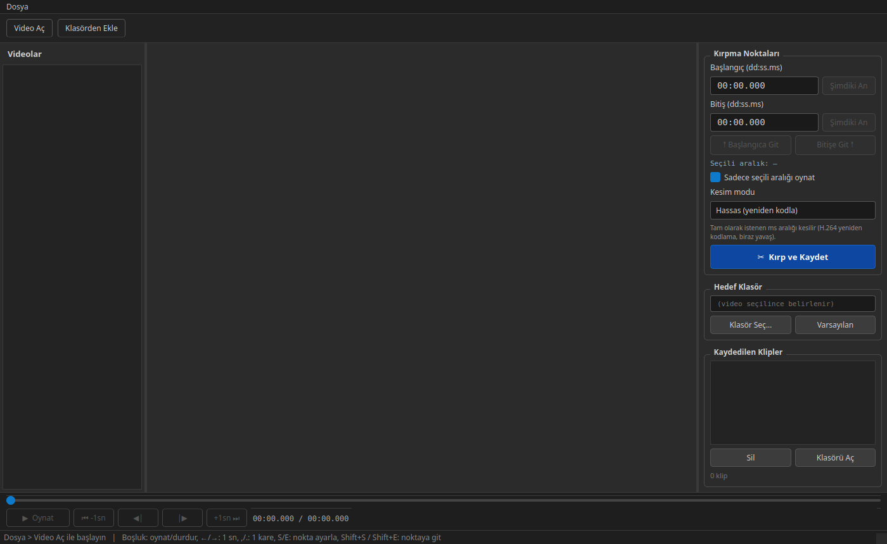
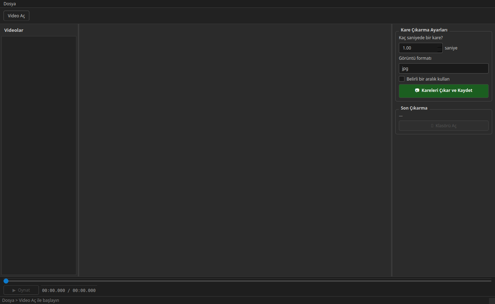
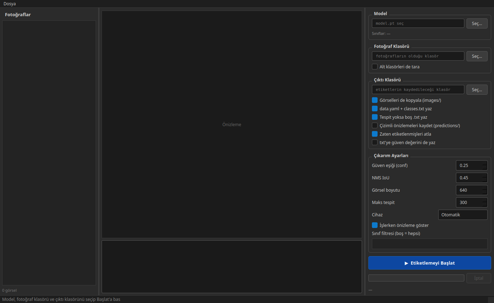
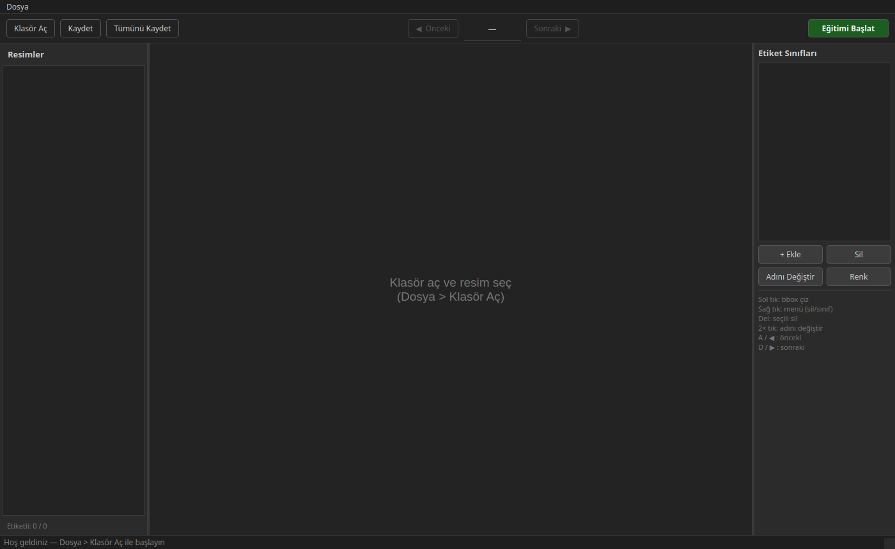
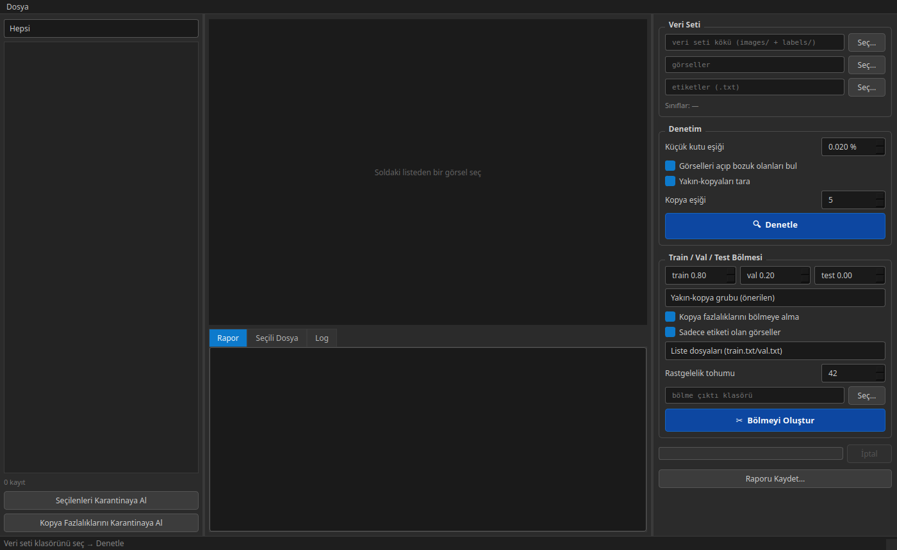
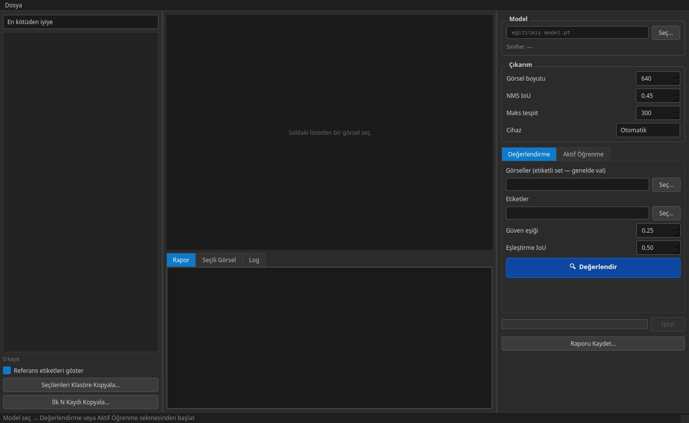
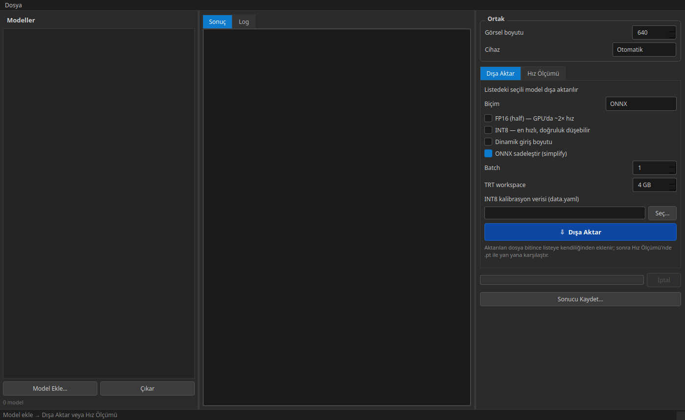

# Boxify 1.0.0 — Yedi Bağımsız Araç

Boxify'ın ilk hâli. Bugünkü birleşik uygulamanın çekirdeğini oluşturan yedi araç, bu sürümde
**her biri ayrı çalıştırılan ayrı birer PyQt5 programıydı**: ortak bir kabuk, ortak bir tema
dosyası ya da ortak bir başlatıcı yoktu — her klasörün kendi `main.py`'si vardı.

Sonraki sürümde ([Boxify-2.0.0](../Boxify-2.0.0/)) bu yedi araç tek uygulamada birleştirildi.

## Bu sürümde neler var

- 7 bağımsız araç, 7 ayrı klasör, 7 ayrı `main.py`
- Koyu (gri-antrasit) tema — her araç kendi stil tanımını taşır
- Etiket biçimi YOLO txt; modeller Ultralytics YOLO
- Labelapp'in iki nesli bir arada: `Labelapp/labelapp` (ilk deneme) ve
  `Labelapp/labelapp2` (eğitim başlatma özellikli güncel hâli)

## Çalıştırma

Her araç kendi klasöründen bağımsız çalıştırılır:

```bash
cd videokırpıcı && python main.py     # (her araç için aynı kalıp)
cd Labelapp/labelapp2 && python main.py
```

**Windows'ta:** Aynı komutlar PowerShell/cmd'de de çalışır (`cd videokırpıcı; python main.py`);
ayrıca **ffmpeg**'i [ffmpeg.org](https://ffmpeg.org/download.html)'dan indirip PATH'e eklemen
gerekir (Video Kırpıcı ve Kare Alıcı bunu kullanır). "Çıktı klasörünü aç" düğmeleri işletim
sistemine göre doğru komutu kendisi seçer (Windows'ta `os.startfile`, Linux'ta `xdg-open`).

## Araçlar

### ✂ Video Kırpıcı (`videokırpıcı/`)

Uzun video kayıtlarını oynatıp işe yarayan zaman aralıklarını işaretler, ffmpeg ile kayıpsız
klipler olarak dışa aktarır. Conda glib'i ile sistem GStreamer eklentilerinin çakışmasını düzelten
`LD_PRELOAD` çözümü ilk kez bu araçta yazıldı (sonraki sürümlerde ortak başlatıcıya taşındı).



### ▣ Kare Alıcı (`KareAlici/`)

Klipleri izleyip tek tek kare yakalar ya da belirli fps ile toplu kare çıkarır — eğitim verisinin
ham fotoğrafları burada üretilir.



### ⚡ Oto Label (`oto-label/`)

Eldeki YOLO modeliyle kareleri tarar, YOLO txt ön etiketleri üretir. Düşük güven eşiğiyle
çalıştırıp Labelapp'te elle düzeltmek en hızlı etiketleme yoludur.



### ✎ Labelapp (`Labelapp/labelapp2/`)

Kutu çizme, taşıma ve sınıf atama arayüzü. Sol panelde resim listesi, sağ panelde etiket
sınıfları; klavye kısayollarıyla hızlı gezinme (A/D önceki/sonraki, Del sil, çift tık yeniden
adlandır). "Eğitimi Başlat" düğmesiyle uygulama içinden YOLO eğitimi tetiklenebilir.



### ☰ Veri Denetçi (`veri-denetci/`)

Bozuk/eksik etiketleri bulur, dHash ile yakın kopyaları gruplar, sorunluları karantinaya taşır ve
sahne sızıntısı olmayan train/val bölmesi üretir. Hiçbir dosya silinmez.



### ◔ Hata Analizi (`hata-analizi/`)

Modeli etiketli sette koşturup kaçırma / uydurma / sınıf karışıklığı dökümü çıkarır; aktif öğrenme
sekmesi bir sonraki turda etiketlenecek en öğretici kareleri seçer.



### ⇥ Model Export (`model-export/`)

Eğitilen modeli ONNX / TensorRT / OpenVINO'ya aktarır, ısınmalı hız ölçümü yapar
(ortalama – medyan – p95) ve dönüşüm sapmasını raporlar.



## Bu sürümün sınırları (2.0.0'a gidişin sebebi)

- Araçlar arasında geçiş yok: her araç için ayrı pencere, ayrı süreç
- Ortak tema/stil yok; görünüm araçtan araca küçük farklar gösteriyor
- Ortak başlatıcı olmadığından GStreamer düzeltmesi gibi çözümler tek araçta kalıyor
- Kurulum/menü kaydı yok; her şey terminalden `python main.py` ile

Bu eksikler, yedi aracın tek kabukta toplandığı [Boxify-2.0.0](../Boxify-2.0.0/)'ı doğurdu.
