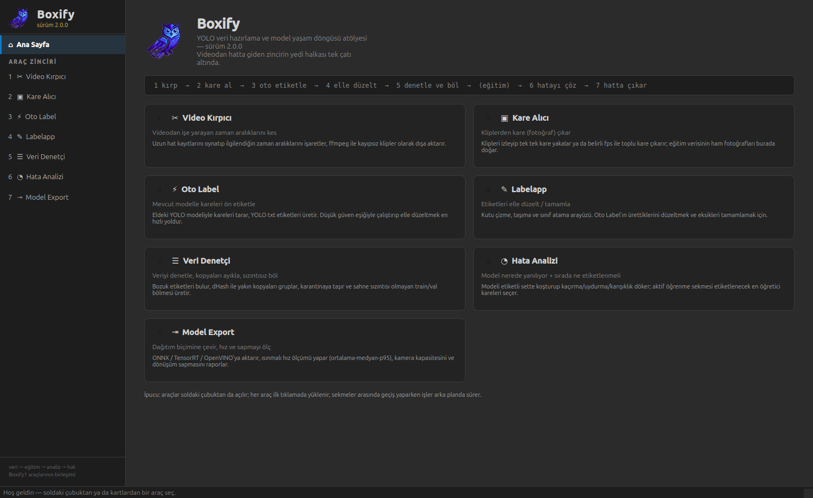
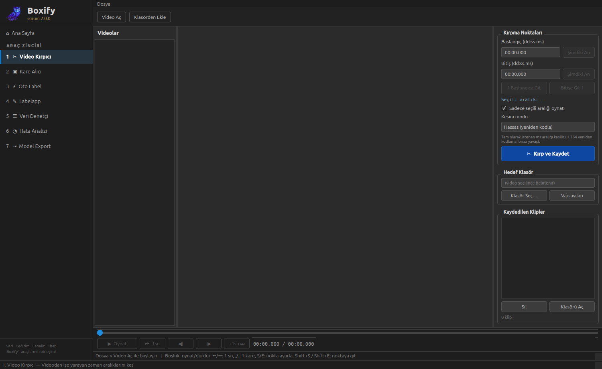
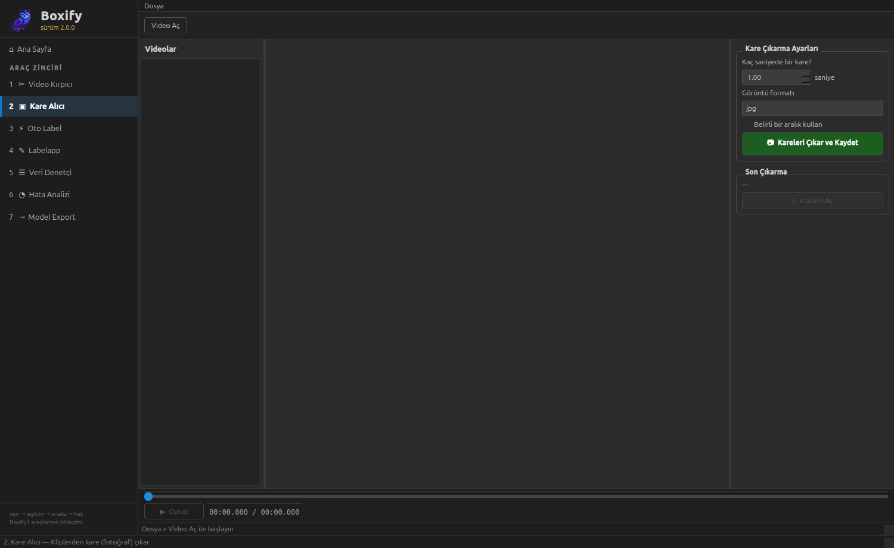
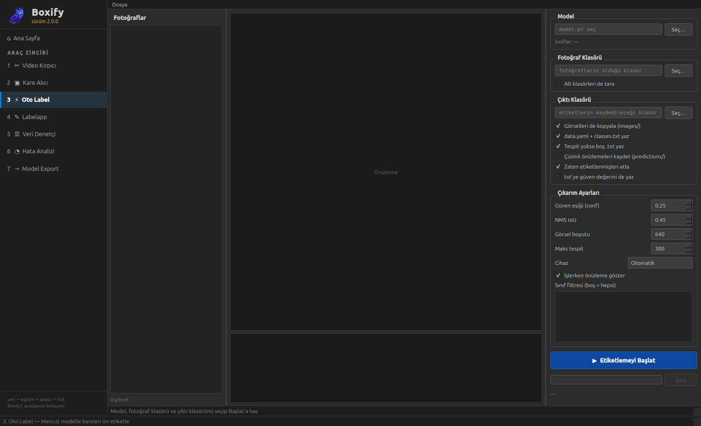
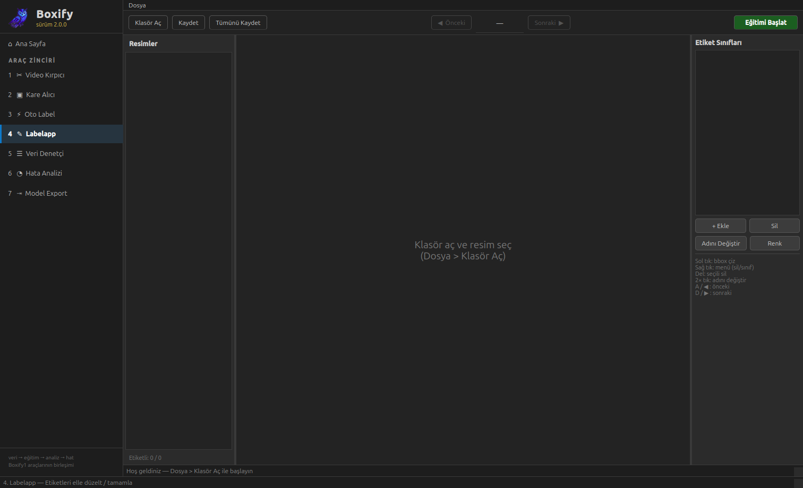
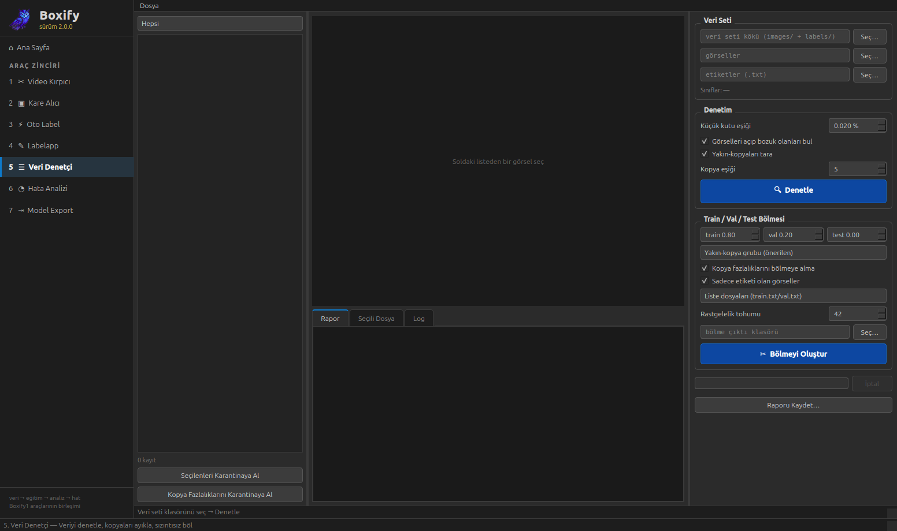
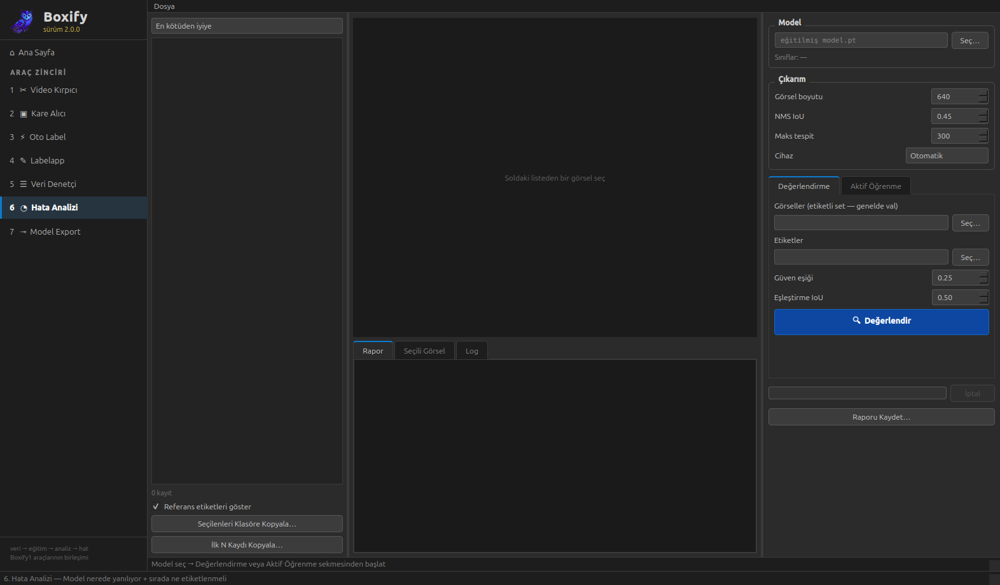
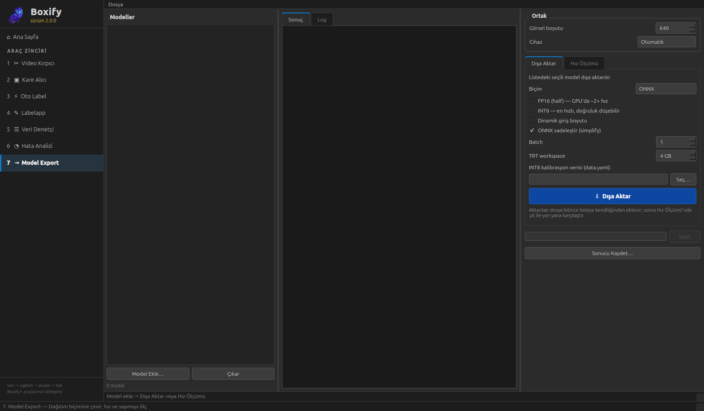

# Boxify 2.0.0 — Birleşik Uygulama (koyu tema)

[Boxify-1.0.0](../Boxify-1.0.0/)'daki yedi bağımsız aracın **tek uygulamada** birleşmiş hâli.
Sol kenar çubuğundan araçlar arasında geçilir; her araç ilk tıklamada yüklenir ve sekme değişse
bile arka plandaki işleri (çıkarım, export, kopyalama…) çalışmaya devam eder.



## 1.0.0'dan neler değişti

- **Tek uygulama, tek pencere:** 7 ayrı program yerine kenar çubuklu bir kabuk
  (`boxify/ana_pencere.py`) + sayfa yığını. Araç pencereleri `Qt.Widget` bayrağıyla kabuğa gömülür.
- **Tembel yükleme:** `ultralytics`/`cv2` gibi ağır bağımlılıklar açılışı yavaşlatmasın diye her
  aracın modülü ancak araç ilk kez açıldığında import edilir.
- **Araç zinciri anlatımı:** Ana sayfada araçlar `1 kırp → 2 kare al → 3 oto etiketle → 4 elle
  düzelt → 5 denetle ve böl → (eğitim) → 6 hatayı çöz → 7 hatta çıkar` şeklinde numaralı bir hat
  olarak sunulur (bu anlatım 2.0.1'de kaldırılacaktı).
- **Ortak koyu tema:** Tek stil dosyası (`boxify/tema.py`); mavi-sarı vurgulu, renk körlüğü dostu.
- **Ortak başlatıcı:** `boxify.py` — GStreamer/glib düzeltmesi artık tüm araçlar için tek yerden
  uygulanır (1.0.0'da yalnızca Video Kırpıcı'da vardı).
- **Menü kaydı:** `kur.sh` ile uygulama Linux menüsüne ikonlu kayıt edilir.
- **Araç kaydı:** Kenar çubuğu ve ana sayfa kartları tek listeden beslenir
  (`boxify/araclar/__init__.py`).

## Araçlar

Zincirdeki sıra numaralarıyla — hepsi koyu temada:

### 1 · ✂ Video Kırpıcı

Videodan işe yarayan zaman aralıklarını keser; ffmpeg ile kayıpsız klip çıkarır.



### 2 · ▣ Kare Alıcı

Kliplerden tek tek ya da belirli fps ile toplu kare (fotoğraf) çıkarır.



### 3 · ⚡ Oto Label

Mevcut YOLO modeliyle kareleri tarayıp YOLO txt ön etiketleri üretir.



### 4 · ✎ Labelapp

Ön etiketleri elle düzeltme, eksik kutuları çizme ve sınıf atama arayüzü.



### 5 · ☰ Veri Denetçi

Bozuk etiketleri bulur, dHash ile yakın kopyaları ayıklar, sızıntısız train/val bölmesi üretir.



### — · Eğitim

`yolo train data=.../data.yaml` — uygulama dışında, terminalden yapılır.

### 6 · ◔ Hata Analizi

Modelin kaçırma / uydurma / karışıklık dökümünü çıkarır; aktif öğrenmeyle sıradaki kareleri seçer.



### 7 · ⇥ Model Export

ONNX / TensorRT / OpenVINO'ya çevirir, hız (ortalama–medyan–p95) ve dönüşüm sapmasını ölçer.



## Çalıştırma

```bash
pip install -r requirements.txt   # önerilen: PyQt5 içeren bir conda ortamı
python boxify.py
```

**Windows'ta:** Uygulama platform bağımsızdır, aynı adımlar PowerShell/cmd'de de çalışır. Ayrıca
**ffmpeg**'i [ffmpeg.org](https://ffmpeg.org/download.html)'dan indirip PATH'e eklemen gerekir
(Video Kırpıcı ve Kare Alıcı bunu kullanır). "Çıktı klasörünü aç" düğmeleri işletim sistemine göre
doğru komutu kendisi seçer (Windows'ta `os.startfile`, Linux'ta `xdg-open`).

## Uygulama menüsüne kaydetme (Linux)

```bash
./kur.sh          # menüye ekler (ikon.png ile)
./kur.sh kaldir   # menüden çıkarır
```

`kur.sh`, PyQt5 içeren ilk python'u otomatik seçer.

## Masaüstü + Başlat Menüsü kısayolu (Windows)

`kur.sh`'ın karşılığı `kur.bat`:

```powershell
.\kur.bat          # ikon.png'yi ikon.ico'ya çevirir, masaüstü + Başlat Menüsü kısayolu ekler
.\kur.bat kaldir   # kısayolları kaldırır
```

## Dizin yapısı

```
Boxify-2.0.0/
├── boxify.py                 # başlatıcı (glib düzeltmesi + QApplication)
├── ikon.png                  # uygulama ikonu
├── kur.sh                    # Linux menü kaydı / kaldırma
├── kur.bat / kur.ps1         # Windows masaüstü + Başlat Menüsü kısayolu
├── requirements.txt
├── gorseller/                # ekran görüntüleri
└── boxify/
    ├── __init__.py           # sürüm bilgisi
    ├── tema.py               # ortak koyu tema (mavi-sarı, renk körlüğü dostu)
    ├── ana_pencere.py        # kabuk: kenar çubuğu + sayfa yığını
    ├── sayfalar/
    │   └── anasayfa.py       # kartlı karşılama panosu
    └── araclar/
        ├── __init__.py       # araç kaydı (ad, açıklama, modül)
        ├── video_kirpici.py
        ├── kare_alici.py
        ├── oto_label.py
        ├── labelapp/         # core/ (veri) + ui/ (arayüz) paketi
        ├── veri_denetci.py
        ├── hata_analizi.py
        └── model_export.py
```

## Notlar

- Her araç modülü **tek başına da çalışır**:
  `python -m boxify.araclar.veri_denetci` (bu dizinde).
- GStreamer "missing a plug-in" düzeltmesi başlatıcıda otomatik uygulanır;
  kapatmak için `VK_NO_GLIB_FIX=1`.
- Hiçbir araç dosya silmez; temizlik daima karantinaya taşımadır.
- Tema kırmızı-yeşil ayrımına dayanmaz: vurgular mavi/sarı, durumlar ayrıca
  metin ve çizgi deseniyle verilir.

## Sonraki sürüm

Koyu tema ve "zincir" anlatımı [Boxify-2.0.1](../Boxify-2.0.1/)'de açık temayla ve bağımsız araç
sunumuyla değiştirildi.
