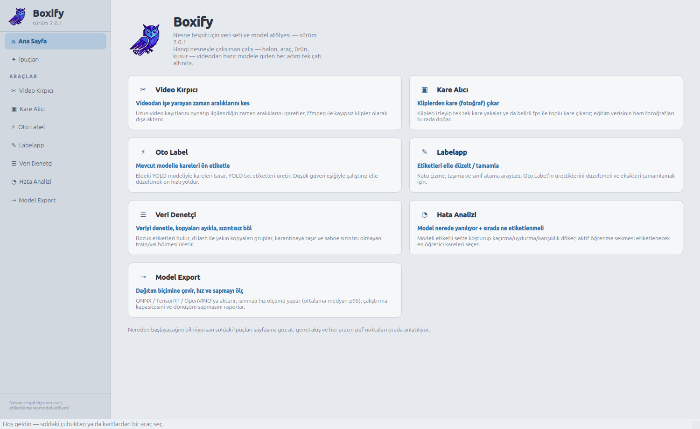
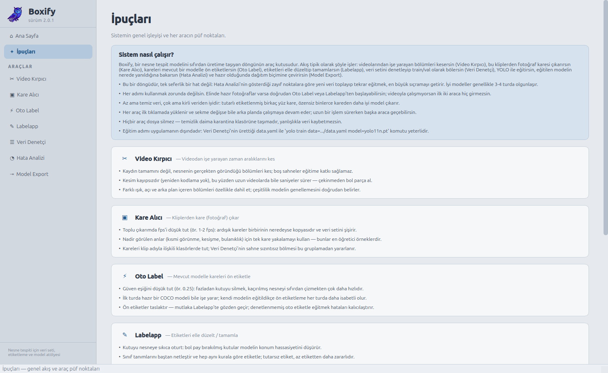
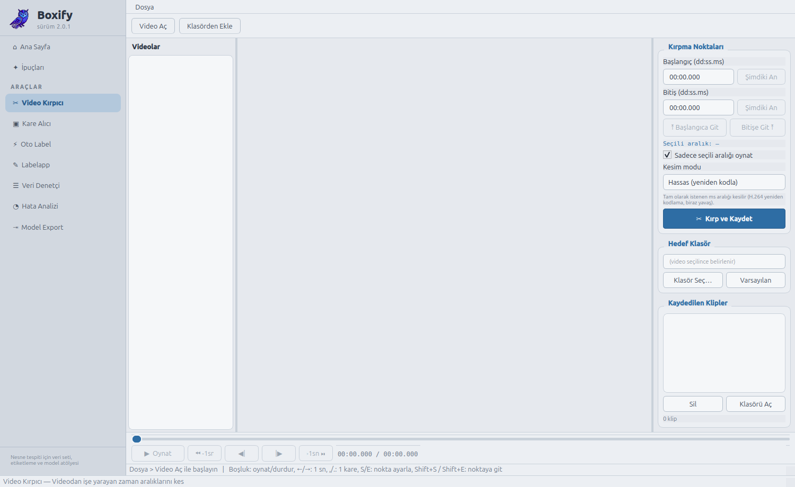
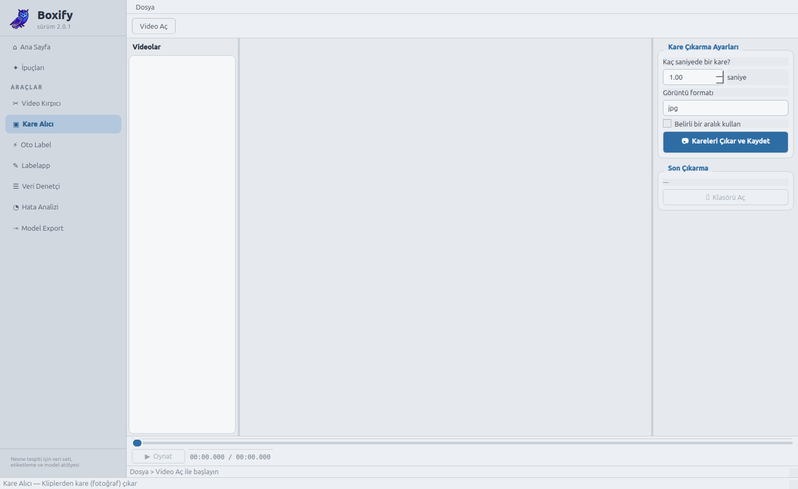
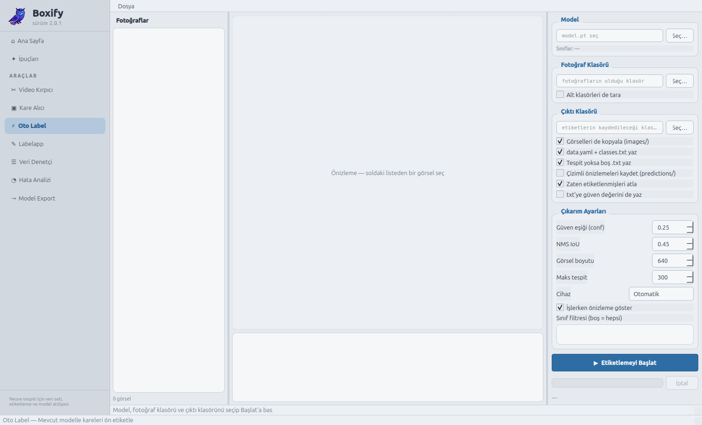
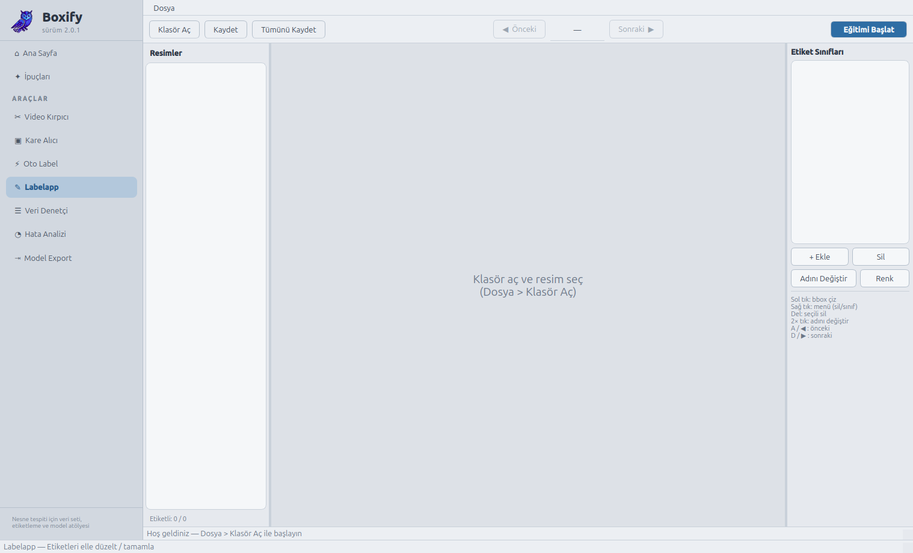
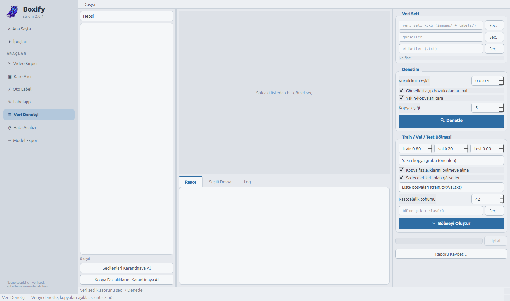
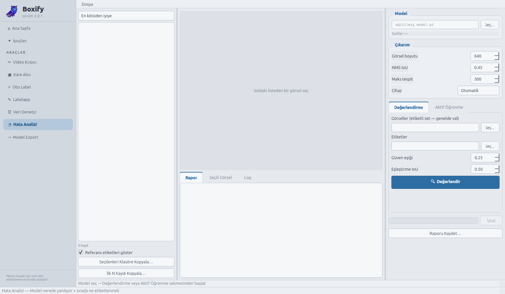
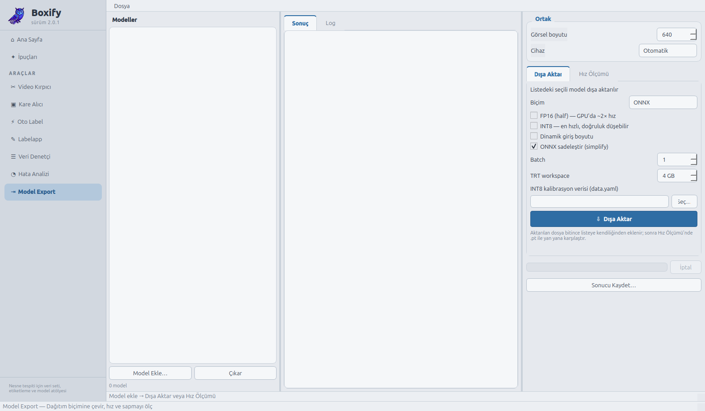

# Boxify 2.0.1 — Açık Tema ve Ürünleştirme

Nesne tespit modeli üretmenin yedi aracı **tek uygulamada**: videodan kare çıkarma, oto/elle
etiketleme, veri denetimi, hata analizi ve model export. Belirli bir alana bağlı değildir —
balon, araç, ürün, kusur… hangi nesneyi tanımlamak istersen aynı akış geçerlidir.



## 2.0.0'dan neler değişti

- **Açık tema:** Koyu gri kabuk bırakıldı; beyaz zemin + mavi vurgu, yenilenen yazı tipleri,
  buton/hover efektleri ve kartlar. Görüntü/video tuvalleri kasıtlı olarak koyu kaldı — kutu
  renkleri koyu zeminde daha iyi seçilir.
- **İpuçları sayfası:** Genel akışın nasıl işlediği ve her aracın püf noktaları artık uygulamanın
  içinde anlatılıyor (`boxify/sayfalar/ipuclari.py`); araç kaydına her araç için `ipuclari`
  listesi eklendi.
- **Zincir kaldırıldı:** Araçlar "1→2→3…" numaralı bir hat gibi değil, ihtiyaca göre kullanılan
  bağımsız araçlar olarak sunuluyor; kenar çubuğundaki adım numaraları ve ana sayfadaki zincir
  şeridi gitti.
- **Alan-bağımsız metinler:** Üretim hattına özgü ifadeler genelleştirildi; uygulama artık hangi
  nesne türü olursa olsun aynı dille konuşuyor.

İpuçları sayfası:



## Araçlar

Hepsi yeni açık temada:

### ✂ Video Kırpıcı

Videodan işe yarayan zaman aralıklarını keser; ffmpeg ile kayıpsız klip çıkarır.



### ▣ Kare Alıcı

Kliplerden tek tek ya da belirli fps ile toplu kare (fotoğraf) çıkarır.



### ⚡ Oto Label

Mevcut YOLO modeliyle kareleri tarayıp YOLO txt ön etiketleri üretir.



### ✎ Labelapp

Ön etiketleri elle düzeltme, eksik kutuları çizme ve sınıf atama arayüzü. Görüntü tuvali
kasıtlı olarak koyu kalır — kutu renkleri koyu zeminde daha iyi seçilir.



### ☰ Veri Denetçi

Bozuk etiketleri bulur, dHash ile yakın kopyaları ayıklar, sızıntısız train/val bölmesi üretir.



### ◔ Hata Analizi

Modelin kaçırma / uydurma / karışıklık dökümünü çıkarır; aktif öğrenmeyle sıradaki kareleri seçer.
(Eğitim adımı uygulama dışıdır: `yolo train data=.../data.yaml`.)



### ⇥ Model Export

ONNX / TensorRT / OpenVINO'ya çevirir, hız (ortalama–medyan–p95) ve dönüşüm sapmasını ölçer.



## Çalıştırma

```bash
pip install -r requirements.txt   # önerilen: PyQt5 içeren bir conda ortamı
python boxify.py
```

**Windows'ta:** Uygulama platform bağımsızdır, aynı adımlar PowerShell/cmd'de de çalışır. Ayrıca
**ffmpeg**'i [ffmpeg.org](https://ffmpeg.org/download.html)'dan indirip PATH'e eklemen gerekir
(Video Kırpıcı ve Kare Alıcı bunu kullanır). "Çıktı klasörünü aç" düğmeleri işletim sistemine göre
doğru komutu kendisi seçer (Windows'ta `os.startfile`, Linux'ta `xdg-open`).

## Uygulama menüsüne kaydetme (Linux)

```bash
./kur.sh          # menüye ekler
./kur.sh kaldir   # menüden çıkarır
```

`kur.sh`, PyQt5 içeren ilk python'u otomatik seçer; diğer sürümlerin menü kayıtlarına dokunmaz.

## Masaüstü + Başlat Menüsü kısayolu (Windows)

`kur.sh`'ın karşılığı `kur.bat`:

```powershell
.\kur.bat          # ikon.png'yi ikon.ico'ya çevirir, masaüstü + Başlat Menüsü kısayolu ekler
.\kur.bat kaldir   # kısayolları kaldırır
```

## Dizin yapısı

```
Boxify-2.0.1/
├── boxify.py                 # başlatıcı (glib düzeltmesi + QApplication)
├── ikon.png                  # uygulama ikonu
├── kur.sh                    # Linux menü kaydı / kaldırma
├── kur.bat / kur.ps1         # Windows masaüstü + Başlat Menüsü kısayolu
├── requirements.txt
├── gorseller/                # ekran görüntüleri
└── boxify/
    ├── __init__.py           # sürüm bilgisi (2.0.1)
    ├── tema.py               # ortak açık tema (beyaz + mavi, renk körlüğü dostu)
    ├── ana_pencere.py        # kabuk: kenar çubuğu + sayfa yığını
    ├── sayfalar/
    │   ├── anasayfa.py       # kartlı karşılama panosu
    │   └── ipuclari.py       # genel akış + araç bazlı ipuçları
    └── araclar/
        ├── __init__.py       # araç kaydı (ad, açıklama, ipuçları, modül)
        ├── video_kirpici.py
        ├── kare_alici.py
        ├── oto_label.py
        ├── labelapp/         # core/ (veri) + ui/ (arayüz) paketi
        ├── veri_denetci.py
        ├── hata_analizi.py
        └── model_export.py
```

## Notlar

- Her araç modülü **tek başına da çalışır**:
  `python -m boxify.araclar.veri_denetci` (bu dizinde).
- GStreamer "missing a plug-in" düzeltmesi başlatıcıda otomatik uygulanır;
  kapatmak için `VK_NO_GLIB_FIX=1`.
- Hiçbir araç dosya silmez; temizlik daima karantinaya taşımadır.
- Tema kırmızı-yeşil ayrımına dayanmaz: vurgular mavi (ikincil olarak koyu metinli kehribar),
  durumlar ayrıca metin ve çizgi deseniyle verilir.

## Sonraki sürüm

[Boxify-2.0.2](../Boxify-2.0.2/)'de arayüze TR/EN dil desteği eklendi.
