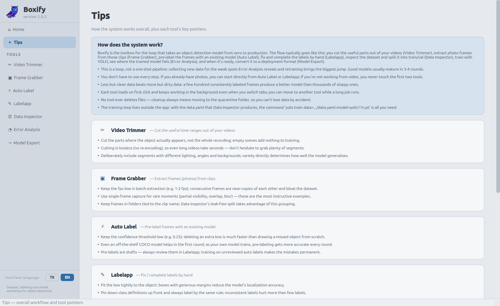

# Boxify 2.0.2 — TR/EN Dil Desteği (güncel sürüm)

Nesne tespit modeli üretmenin yedi aracı **tek uygulamada**: videodan kare çıkarma, oto/elle
etiketleme, veri denetimi, hata analizi ve model export. Belirli bir alana bağlı değildir —
balon, araç, ürün, kusur… hangi nesneyi tanımlamak istersen aynı akış geçerlidir.

Sol kenar çubuğundan araçlar arasında geçilir; her araç ilk tıklamada yüklenir ve sekme değişse
bile arka plandaki işleri (çıkarım, export, kopyalama…) çalışmaya devam eder.

| Türkçe | English |
|---|---|
|  |  |

## 2.0.1'den neler değişti

- **TR/EN arayüz dili:** Kenar çubuğunun dibindeki TR/EN düğmeleriyle dil değiştirilir; seçim
  `~/.config/boxify4/ayarlar.json` dosyasına kaydedilir ve onay sonrası uygulama yeniden
  başlatılarak uygulanır (araçlar tembel yüklendiği için dilin her yere işlemesinin tek güvenilir
  yolu temiz bir başlangıçtır).
- **Dil desteği eklenti olarak eklendi** (`boxify/dil.py`): araç modüllerinin koduna dokunulmadı.
  İngilizce seçiliyken PyQt metin API'leri (QLabel/QPushButton kurucuları, `setText`,
  `setToolTip`, QMessageBox/QFileDialog statikleri…) monkey-patch ile `tr()` çeviri süzgecinden
  geçirilir; sözlükte olmayan metin (dosya yolu, sınıf adı, bazı anlık log satırları) olduğu gibi
  Türkçe kalır. Türkçe moddayken hiçbir yama kurulmaz.
- **Çeviri iki katmanlıdır:** `SOZLUK` (~376 birebir TR→EN kayıt) + `KALIPLAR` (regex şablonları —
  "N görsel", "Kaydedildi: X" gibi çalışma anında üretilen metinler; yakalanan gruplar `tr()`'den
  yeniden geçer).
- **Yeni dil eklemek kolay:** `boxify/dil.py` içindeki `SOZLUK`/`KALIPLAR` yapısına yeni bir
  sözlük eklemek ve `DILLER`'i genişletmek yeterlidir.

İpuçları sayfası iki dilde:

| Türkçe | English |
|---|---|
|  |  |

## Araçlar

### ✂ Video Kırpıcı

Videodan işe yarayan zaman aralıklarını keser; ffmpeg ile kayıpsız klip çıkarır.


### ▣ Kare Alıcı

Kliplerden tek tek ya da belirli fps ile toplu kare (fotoğraf) çıkarır.


### ⚡ Oto Label

Mevcut YOLO modeliyle kareleri tarayıp YOLO txt ön etiketleri üretir.


### ✎ Labelapp

Ön etiketleri elle düzeltme, eksik kutuları çizme ve sınıf atama arayüzü.


### ☰ Veri Denetçi

Bozuk etiketleri bulur, dHash ile yakın kopyaları ayıklar, sızıntısız train/val bölmesi üretir.


### ◔ Hata Analizi

Modelin kaçırma / uydurma / karışıklık dökümünü çıkarır; aktif öğrenmeyle sıradaki kareleri seçer.
(Eğitim adımı uygulama dışıdır: `yolo train data=.../data.yaml`.)


### ⇥ Model Export

ONNX / TensorRT / OpenVINO'ya çevirir, hız (ortalama–medyan–p95) ve dönüşüm sapmasını ölçer.


## Çalıştırma

```bash
pip install -r requirements.txt   # önerilen: PyQt5 içeren bir conda ortamı
python boxify.py
```

**Windows'ta:** Uygulama platform bağımsızdır, aynı adımlar PowerShell/cmd'de de çalışır. Ayrıca
**ffmpeg**'i [ffmpeg.org](https://ffmpeg.org/download.html)'dan indirip PATH'e eklemen gerekir
(Video Kırpıcı ve Kare Alıcı bunu kullanır).

## Uygulama menüsüne kaydetme (Linux)

```bash
./kur.sh          # menüye "Boxify" olarak ekler (boxify.desktop)
./kur.sh kaldir   # menüden çıkarır
```

`kur.sh`, PyQt5 içeren ilk python'u otomatik seçer, ikonu 512×512 kare yapıp hicolor temasına
kurar. Klasörün adı ya da yeri değişirse `kur.sh`'ı bir kez daha çalıştırmak yeterlidir —
kısayolu yeni yola göre kendisi yeniden yazar.


## Masaüstü + Başlat Menüsü kısayolu (Windows)

`kur.sh`'ın karşılığı `kur.bat`:

```powershell
.\kur.bat          # ikon.png'yi ikon.ico'ya çevirir, masaüstü + Başlat Menüsü kısayolu ekler
.\kur.bat kaldir   # kısayolları kaldırır
```

## Dizin yapısı

```
Boxify-2.0.2/
├── boxify.py                 # başlatıcı (glib düzeltmesi + dil yamaları + QApplication)
├── ikon.png                  # uygulama ikonu
├── kur.sh                    # Linux menü kaydı / kaldırma (boxify.desktop)
├── kur.bat / kur.ps1         # Windows masaüstü + Başlat Menüsü kısayolu
├── requirements.txt
├── gorseller/                # ekran görüntüleri
└── boxify/
    ├── __init__.py           # sürüm bilgisi (2.0.2)
    ├── dil.py                # dil eklentisi: TR/EN sözlük + PyQt çeviri yamaları
    ├── tema.py               # ortak açık tema (beyaz + mavi, renk körlüğü dostu)
    ├── ana_pencere.py        # kabuk: kenar çubuğu + sayfa yığını + dil değiştirici
    ├── sayfalar/
    │   ├── anasayfa.py       # kartlı karşılama panosu
    │   └── ipuclari.py       # genel akış + araç bazlı ipuçları
    └── araclar/
        ├── __init__.py       # araç kaydı (ad, açıklama, ipuçları, modül)
        ├── video_kirpici.py
        ├── kare_alici.py
        ├── oto_label.py
        ├── labelapp/         # core/ (veri) + ui/ (arayüz) paketi
        ├── veri_denetci.py
        ├── hata_analizi.py
        └── model_export.py
```

## Notlar

- Her araç modülü **tek başına da çalışır**:
  `python -m boxify.araclar.veri_denetci` (bu dizinde). Tek başına çalıştırmada arayüz TR kalır.
- GStreamer "missing a plug-in" düzeltmesi başlatıcıda otomatik uygulanır;
  kapatmak için `VK_NO_GLIB_FIX=1`.
- Hiçbir araç dosya silmez; temizlik daima karantinaya taşımadır.
- Tema kırmızı-yeşil ayrımına dayanmaz: vurgular mavi (ikincil olarak koyu metinli kehribar),
  durumlar ayrıca metin ve çizgi deseniyle verilir.
- Görüntü/video tuvalleri kasıtlı olarak koyu kalır (kutu renkleri üzerinde daha iyi seçilir);
  uygulama kabuğu açık temadır.
