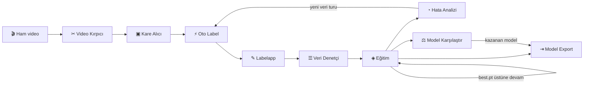
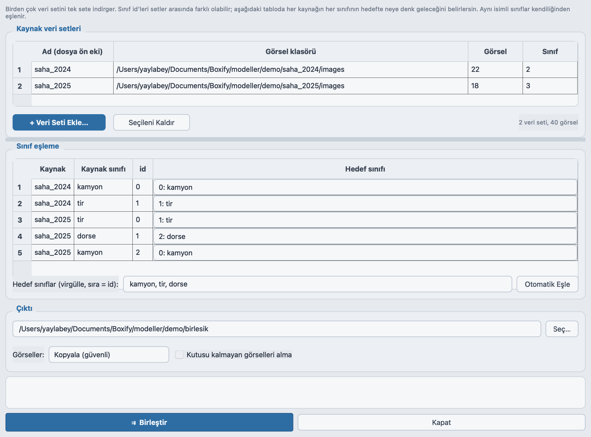
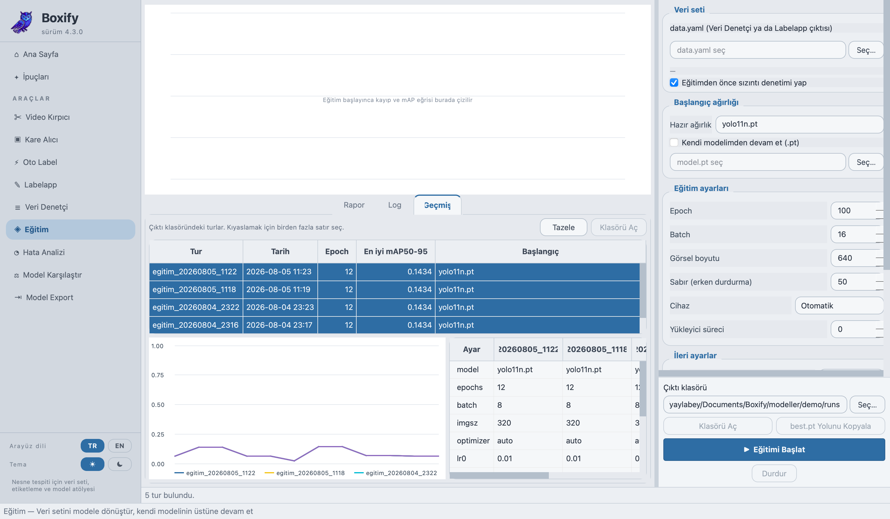
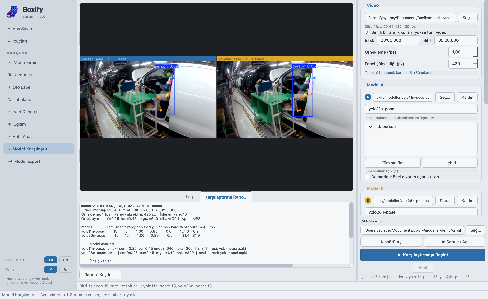
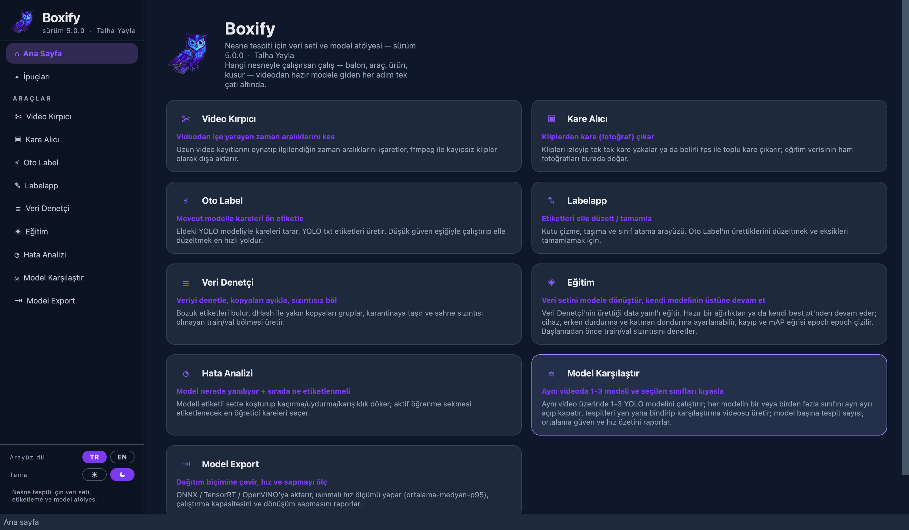

# 🦉 Boxify — Nesne Tespiti Veri ve Model Atölyesi

Boxify, bir **nesne tespit (object detection) modeli** üretmenin bütün adımlarını tek çatı altında
toplayan, PyQt5 ile yazılmış bir masaüstü uygulamasıdır: videodan kare çıkarma, otomatik ve elle
etiketleme, veri seti denetimi, **eğitim**, hata analizi, model karşılaştırma ve model export.

Belirli bir alana bağlı değildir — balon, araç, ürün, kusur… hangi nesneyi tanımak istersen aynı
akış geçerlidir. Etiket biçimi YOLO txt'dir ve araçlar Ultralytics YOLO modelleriyle çalışır.


---

## Kurulum ve çalıştırma

Boxify **macOS, Linux ve Windows'ta** aynı şekilde çalışır: `boxify.py` ve `boxify/` paketi
platform bağımsızdır, işletim sistemine göre değişen her şey (klasör açma, ffmpeg kurulum
ipucu, GPU seçeneği, kısayol kurulumu) kodun içinde zaten ayrılmıştır. Aşağıdaki üç adım
her sistemde geçerli; sadece komutların yazımı değişir.

### 1) Bağımlılıkları kur

Conda gerekmez — sade bir Python sanal ortamı (`venv`) yeterli.

**macOS / Linux**

```bash
python3 -m venv .venv
source .venv/bin/activate
pip install -r requirements.txt
```

**Windows** (PowerShell)

```powershell
python -m venv .venv
.venv\Scripts\activate
pip install -r requirements.txt
```

Başlıca bağımlılıklar: `PyQt5`, `numpy`, `opencv-python`, `ultralytics>=8.4`, `PyYAML`.
TensorRT ve OpenVINO isteğe bağlıdır (yalnızca o export biçimleri için).

Ayrıca sistemde **ffmpeg** kurulu olmalı — Video Kırpıcı ve Kare Alıcı işi ona yaptırır.
ffmpeg bir Python paketi değil, sistem paketidir; `pip` onu kuramaz:

| Sistem | Komut |
|---|---|
| **macOS** | `brew install ffmpeg` |
| **Linux** | `sudo apt install ffmpeg` (Debian/Ubuntu) · `sudo dnf install ffmpeg` (Fedora) |
| **Windows** | `winget install ffmpeg` — ya da [ffmpeg.org](https://ffmpeg.org/download.html)'dan indirip PATH'e ekle |

ffmpeg yoksa uygulama açılır ve diğer yedi araç normal çalışır; bu iki araç kendi düğmesini
kapatıp durum çubuğunda **platformuna uygun** kurulum komutunu gösterir.

#### conda ile kurulum (önerilen)

`ultralytics` ve `torch` gibi paketlerin ikili bağımlılıklarını — özellikle CUDA'lı
kurulumlarda — conda daha temiz çözer. Zaten conda kullanıyorsan bunu tercih et; komutlar üç
sistemde de aynıdır:

```bash
conda create -n boxify python=3.11
conda activate boxify
pip install -r requirements.txt
```

PyQt5 + ultralytics içeren bir ortamın zaten varsa doğrudan onu aktive edip devam edebilirsin —
`pip install` adımı gerekmez.

### 2) Uygulamayı çalıştır

Üç sistemde de aynı komut:

```bash
python boxify.py
```

#### Sistemler arasında ne değişiyor?

Hiçbiri elle ayar istemez — uygulama çalıştığı sistemi tanıyıp doğrusunu seçer:

| Konu | macOS | Linux | Windows |
|---|---|---|---|
| **GPU seçeneği** | GPU (Apple MPS) | GPU (cuda:0) | GPU (cuda:0) |
| **Klasör açma** | `open` | `xdg-open` | `os.startfile` |
| **ffmpeg kurulum ipucu** | `brew install` | `sudo apt install` | `winget install` |
| **Eğitimde yükleyici süreci** | 0 (varsayılan) | 8 (varsayılan) | 0 (varsayılan) |
| **Uygulama kısayolu** | `kur.sh` → `Boxify.app` | `kur.sh` → `.desktop` | `kur.bat` → `.lnk` |
| **GStreamer/glib düzeltmesi** | gerekmez | otomatik | gerekmez |

Birkaç ayrıntı:

- **GPU:** Apple donanımında CUDA yoktur, yerine Metal (MPS) vardır; listede `cuda:0` sunmak
  her karede `Invalid CUDA device` ile patlayan sessiz bir koşuya yol açıyordu. Seçenekler
  artık platforma göre üretilir (`boxify/araclar/model_bilgi.py`).
- **Eğitimde yükleyici süreci:** macOS ve Windows alt süreçleri `spawn` ile açar — her işçi
  yorumlayıcıyı sıfırdan kurar. Eğitim bir arka plan iş parçacığından başlatıldığı için bu,
  o iki sistemde takılmaya yol açabiliyor; varsayılan 0. Linux `fork` kullandığından 8 ile
  başlar. İstersen her sistemde değiştirebilirsin.
- **GStreamer/glib düzeltmesi:** yalnızca Linux'ta anlamlıdır (conda glib'i ile sistem
  eklentileri çakışınca oynatıcı hiç açılmaz). `boxify/gstreamer_yardim.py` bunu Linux'ta
  otomatik uygular, diğer sistemlerde hiçbir şey yapmaz. Kapatmak için `VK_NO_GLIB_FIX=1`.

> **Kısayol:** Bu adımı elle yapmak yerine kurulum betiğine de yaptırabilirsin —
> conda varsa onu tercih eder:
>
> ```bash
> ./kur.sh ortam          # macOS / Linux  (conda varsa conda, yoksa venv)
> ./kur.sh ortam conda    # zorla conda
> ./kur.sh ortam venv     # zorla venv
> ```
> ```powershell
> .\kur.bat ortam         # Windows
> ```
>
> Ortam adı varsayılan olarak `boxify`, Python sürümü `3.11`; değiştirmek için
> `BOXIFY_ENV` ve `BOXIFY_PY` ortam değişkenlerini kullan. Betik ortamı kurduktan
> sonra hangi yorumlayıcıyı kurduğunu `.boxify_python` dosyasına yazar, böylece
> bir sonraki adımdaki uygulama kaydı doğru ortamı kendiliğinden bulur.
>
> Ortam + uygulama kaydını tek komutta yapmak için: `./kur.sh tam` (`kur.bat tam`).

### 3) (İsteğe bağlı) Uygulama listesine ekle

Her seferinde terminalden `python boxify.py` yazmak yerine Boxify'ı işletim sisteminin uygulama
listesine kaydedebilirsin. **macOS ve Linux'ta `kur.sh`, Windows'ta `kur.bat`** — ikisi de
sistemi kendi tanır ve o sisteme uygun kurulumu yapar.

```bash
./kur.sh            # macOS ve Linux
./kur.sh kaldir     # geri al
```

```powershell
.\kur.bat           # Windows
.\kur.bat kaldir    # geri al
```

Sisteme göre ne ürettiği:

| Sistem | Ürettiği | Nerede görünür |
|---|---|---|
| **macOS** | `~/Applications/Boxify.app` (Info.plist + `.icns` ikon) | Launchpad, Spotlight; Dock'a sabitlenebilir |
| **Linux** | `~/.local/share/applications/boxify.desktop` + hicolor ikonu | Uygulama menüsü / Show Apps |
| **Windows** | Masaüstünde ve Başlat Menüsü'nde `Boxify.lnk` (`ikon.ico` ile) | Masaüstü, Başlat Menüsü |

Her üçü de python'u aynı mantıkla arar: önce **PyQt5 *ve* ultralytics'in birlikte bulunduğu**
bir yorumlayıcı; yoksa PyQt5 yeten biri seçilir ama eksik paket açıkça söylenir. Sıra
`BOXIFY_PYTHON` → etkin sanal ortam → `.venv` → conda ortamları → sistem python'u şeklindedir.
Kullanmak istediğini elle de gösterebilirsin:

```bash
# macOS / Linux
BOXIFY_PYTHON=/opt/anaconda3/envs/boxify/bin/python ./kur.sh
```

```powershell
# Windows
$env:BOXIFY_PYTHON = "C:\Users\ad\anaconda3\envs\boxify\python.exe"; .\kur.bat
```

> Neden ultralytics de aranıyor? conda kullananlarda `base` ortamında PyQt5 hazır gelir ama
> ultralytics gelmez. Sadece PyQt5'e bakan bir kurulum tam da o ortamı seçer; uygulama açılır,
> ama dokuz araçtan beşi ilk tıklamada "eksik bağımlılık" der.

Beklenen çıktı şuna benzer:


Klasörün adı ya da yeri değişirse betiği bir kez daha çalıştır — kısayolu yeni yola göre
kendisi yeniden yazar. Linux'ta menüde görünmezse oturumu yenilemek genelde yeterlidir.

---

## Sürüm geçmişi

Her sürüm bir **git tag'i** olarak işaretlidir; eski bir sürümü çalışır hâlde görmek için o tag'e
geçmen yeterli:

```bash
git checkout v2.0.2      # o sürümün tam ağacı
git checkout main        # güncele dön
```

| Sürüm | Ne oldu? |
|---|---|
| [`v1.0.0`](../../releases/tag/v1.0.0) | Başlangıç: **7 bağımsız araç**, her biri ayrı çalıştırılan ayrı program, koyu tema |
| [`v2.0.0`](../../releases/tag/v2.0.0) | 7 araç **tek uygulamada** birleşti: kenar çubuklu kabuk, tembel yükleme, "araç zinciri" anlatımı |
| [`v2.0.1`](../../releases/tag/v2.0.1) | Ürünleştirme: **açık beyaz-mavi tema**, İpuçları sayfası, zincir/adım numaraları kaldırıldı, metinler alan-bağımsız hâle getirildi |
| [`v2.0.2`](../../releases/tag/v2.0.2) | **TR/EN arayüz dili**: çeviri, araç kodlarına dokunmayan bir dil eklentisiyle (`dil.py`) yapıldı |
| [`v3.0.0`](../../releases/tag/v3.0.0) | **⚖ Model Karşılaştır** (sekizinci araç) + arayüz akıcılığı düzeltmeleri; depo tek kod tabanına düzleştirildi |
| [`v4.0.0`](../../releases/tag/v4.0.0) | **Döngü uygulamanın içinde kapandı:** ◈ Eğitim (dokuzuncu araç) + ⇉ veri seti birleştirme/sınıf eşleme + sızıntılı bölme hatasının düzeltilmesi + platforma göre kurulum (macOS `.app`) |
| [`v4.1.0`](../../releases/tag/v4.1.0) | **☀/☾ Açık ve koyu tema** + platform desteğinin macOS/Linux/Windows'ta eşitlenmesi (GStreamer düzeltmesi ARM Linux'ta da çalışıyor) |
| [`v4.2.0`](../../releases/tag/v4.2.0) | **Yol hafızası** (33 diyalog son kullanılan klasörü hatırlıyor) + kurulum betikleri artık ortamı da kuruyor (`kur.sh ortam`, conda öncelikli) — **güncel sürüm** |

### 4.2.0'da neler değişti

- **Yol hafızası.** Dokuz araçta 33 dosya/klasör seçim diyalogu var ve hiçbiri son kullanılan
  yeri hatırlamıyordu; her tur aynı üç beş klasöre onlarca kez elle gidiliyordu. Artık her
  diyalog kendi son klasörünü hatırlıyor. Araç kodlarına dokunulmadı — dil ve temada olduğu
  gibi `QFileDialog` yamalandı.
- **Kurulum betikleri ortamı da kuruyor.** Önceden yalnızca var olan bir python'u buluyorlardı;
  ortamı sen kurmak zorundaydın. `./kur.sh ortam` (Windows'ta `kur.bat ortam`) artık ortamı
  sıfırdan kuruyor — **conda varsa conda ile**, yoksa venv ile — ve `requirements.txt`'i
  yüklüyor. `./kur.sh tam` ikisini birden yapar.

### 4.1.0'da neler değişti

- **Açık/koyu tema.** Kenar çubuğunun dibinde, dil düğmelerinin altında. Seçim dil ile aynı
  dosyada saklanır ve dokuz aracın tamamına işler. Araç kodlarına hiç dokunulmadı; `setStyleSheet`
  yamalanıp koyu temada renkler çevriliyor — dil desteğindeki desenin aynısı. Veri renkleri
  (tespit kutuları, eğri renkleri) bilerek değişmiyor.
- **Platform desteği eşitlendi.** README'de "Windows'ta çalıştırma" diye ayrı bir bölüm vardı;
  sanki uygulama Windows'ta ek şartlarla çalışıyormuş gibi okunuyordu. Kaldırıldı, yerine üç
  sistemi yan yana veren bir yapı kondu. Kodda da asimetri vardı: GStreamer/glib düzeltmesi
  kütüphane yolunu sabit yazdığı için **ARM Linux'ta hiç çalışmıyordu**; artık çoklu-mimari
  dizinleri taranıyor. Eğitimdeki yükleyici süreci varsayılanı Windows'ta da 0 oldu (o da
  macOS gibi `spawn` kullanıyor).

### 4.0.0'da neler değişti

- **◈ Eğitim — dokuzuncu araç.** Döngünün kapandığı yer. Eğitim daha önce Labelapp'in içinde bir
  diyalogdu ve yalnızca hazır ağırlıklardan (`yolo11m` gibi) başlayabiliyordu; **kendi `best.pt`'nin
  üstüne devam etmek mümkün değildi**, yani ince ayar döngüsü aslında hiç kapanmıyordu. Yeni araçta
  başlangıç ağırlığı herhangi bir `.pt` olabilir; cihaz (MPS/CUDA/CPU), erken durdurma, katman
  dondurma, resume ve ara kayıt ayarlanır, kayıp ve mAP eğrisi epoch epoch çizilir.
- **Sızıntılı bölme hatası kapatıldı.** Labelapp'in veri seti dışa aktarımı `random.shuffle` ile
  bölüyordu — oysa bu uygulamada görseller ardışık video karelerinden gelir ve komşu kareler
  birbirinin neredeyse aynısıdır. Aynı an hem train'e hem val'e düşünce doğrulama skoru şişiyor,
  model ezberlediği hâlde iyi görünüyordu. Gerçek karelerle ölçüldüğünde **4 sahnenin 3'ü ikiye
  bölünüyordu; gruplama sonrası sıfır.** Bölme artık Veri Denetçi ile aynı koddan geliyor
  (`boxify/araclar/veri_bolme.py`) ve ikinci bir bölme kodu yok.
- **Eğitim öncesi sızıntı denetimi.** Eğitim başlamadan `data.yaml`'daki train ve val bölümleri
  yakın-kopya için taranır; ortak sahne bulunursa örnekleriyle birlikte söylenir ve eğitim
  kullanıcı onaylamadan başlamaz.
- **⇉ Veri seti birleştirme + sınıf eşleme** (Veri Denetçi'den açılır). Farklı setlerde sınıf
  id'leri çakışır — birinde `0=kamyon`, ötekinde `0=tır` olabilir; üst üste kopyalamak etiketleri
  sessizce bozar. Artık her kaynağın her sınıfının hedefte neye denk geleceği tek tek seçilir,
  aynı isimliler kendiliğinden eşlenir, istenmeyen sınıf `(atla)` ile düşürülür. Dosya adı
  çakışması kaynak ön ekiyle çözülür.
- **Kurulum işletim sistemine göre.** `kur.sh` yalnızca Linux'a `.desktop` yazıyordu; macOS'ta
  hiçbir işe yaramadığı hâlde "kuruldu" diyordu. Artık macOS'ta gerçek bir `Boxify.app` paketi
  (`Info.plist` + `sips`/`iconutil` ile `.icns`) üretiyor. Üç betik de python'u ararken PyQt5'in
  yanında **ultralytics'i de** arıyor — conda `base` ortamı bu yüzden yanlışlıkla seçiliyordu.
- **Kare Alıcı ffmpeg yokken sessizce ölüyordu** — `Popen` iş parçacığının içinde patlıyor, hiçbir
  sinyal çıkmıyor ve arayüz ilerlemeyen bir çubukta asılı kalıyordu. Artık hata kurulum komutuyla
  birlikte bildiriliyor ve denetim açılışta yapılıyor.

### 3.0.0'da neler değişti

- **⚖ Model Karşılaştır** — aynı video üzerinde 1–3 YOLO modelini kıyaslayan yeni araç.
  Her modelin **sınıfları tek tek açılıp kapatılabilir** ve istenirse her model **kendi conf /
  IoU / imgsz / maks-tespit ayarıyla** koşturulabilir. Tek modelle de çalışır.
- **Araç geçişlerindeki donmalar giderildi** — üç ayrı kaynak vardı: ana iş parçacığında yapılan
  `YOLO()` çağrısı, gömülü sayfaların ana pencereye taşan alt boyut sınırı ve kurucu içinde
  açılan modal diyalog. Ayrıntı: [Teknik notlar](#teknik-notlar).
- **Araç içindeki düğmeler tıklanamıyordu** — araçlar kendi modüllerinde üst düzey birer
  `QMainWindow` olarak doğuyor; macOS'ta buna yerel bir pencere atanıyor ve `setWindowFlags`
  gömmeden *önce* çağrılırsa o pencere ayakta kalıp konumunu eski koordinatlarından bildiriyordu.
  Araç doğru yerde çiziliyor ama fare isabeti yüzlerce piksel ötede aranıyordu (çok monitörlü
  kurulumda çok belirgin). Artık önce reparent, sonra bayrak. Bkz. [Teknik notlar](#teknik-notlar).
- **Önizlemede tek panel görünüyordu** — `QLabel` kendisine pixmap atanınca boyut talebini
  pixmap kadar yapar. Önizleme kaydırma alanı içindeyken bu bir geri besleme döngüsü kuruyordu
  (büyük pixmap → araç genişler → daha büyük pixmap); araç görünür alanı aşıp yatay kaydırmaya
  düşüyor ve mozaiğin sağ yarısı, yani ikinci/üçüncü model, ekran dışında kalıyordu. Önizlemenin
  boyut talebi artık pixmap'ten bağımsız.
- **Sol panel erişilebilirliği** — Model Karşılaştır'da en çok kullanılan denetimler kıvrımın
  altında kalıyordu. Çıktı klasörü, Klasörü Aç / Sonucu Aç, Başlat ve İptal artık kaydırmayan bir
  şeritte sabit duruyor.
- **Depo düzleştirildi** — kod artık kökte tek bir ağaçta (`boxify.py` + `boxify/`); eski sürüm
  klasörleri kaldırıldı, geçmiş yukarıdaki tag'lerde duruyor.
- **Cihaz seçimi platforma göre** — Apple donanımında artık `cuda:0` yerine **GPU (Apple MPS)**
  sunuluyor. Önceden macOS'ta CUDA seçilebiliyordu ve her kare `Invalid CUDA device` ile patlayıp
  sessizce boş bir rapor üretiyordu; artık bir model hiçbir karede çalışamazsa bu açıkça bildirilir.
- **Çeviri boşlukları kapatıldı** — Hata Analizi, Model Export, Veri Denetçi ve Video Kırpıcı'da
  İngilizce moda düşmeyen 26 etiket tamamlandı.

---

## Genel akış

Ham videodan dağıtıma hazır modele giden yol:



Zincirin tamamı uygulamanın içindedir — eğitim dahil. Hata Analizi'nin çıktısı yeni bir
etiketleme turunu besler ve Eğitim aynı `best.pt`'nin üstünden devam eder; döngü, model hedef
başarıya ulaşana kadar döner.

---

## Araçlar

Dokuz araç, sol kenar çubuğundan ya da ana sayfadaki kartlardan açılır. Her araç ilk tıklamada
yüklenir (tembel yükleme) ve sekme değişse bile arka plandaki işleri — çıkarım, eğitim, export,
kopyalama — çalışmaya devam eder.

### ✂ Video Kırpıcı — videodan işe yarayan zaman aralıklarını kes

Uzun video kayıtlarını oynatıp ilgilendiğin zaman aralıklarını işaretler, **ffmpeg ile kayıpsız**
(yeniden kodlamasız) klipler olarak dışa aktarır. Kesim saniyeler sürer; farklı ışık, açı ve arka
plan içeren bölümleri bol bol almak modelin genellemesini doğrudan iyileştirir.


### ▣ Kare Alıcı — kliplerden kare (fotoğraf) çıkar

Klipleri izleyip tek tek kare yakalar ya da belirli fps ile toplu kare çıkarır; eğitim verisinin
ham fotoğrafları burada doğar. Toplu çıkarımda düşük fps (1–2) önerilir — ardışık kareler
birbirinin kopyasıdır ve veri setini şişirir.


### ⚡ Oto Label — mevcut modelle kareleri ön etiketle

Eldeki YOLO modeliyle kareleri tarar, YOLO txt etiketleri üretir. Düşük güven eşiğiyle (örn. 0.25)
çalıştırıp elle düzeltmek, sıfırdan etiketlemekten çok daha hızlıdır: fazladan kutuyu silmek,
kaçırılmış nesneyi çizmekten kolaydır. İlk turda hazır bir COCO modeli bile işe yarar.


### ✎ Labelapp — etiketleri elle düzelt / tamamla

Kutu çizme, taşıma ve sınıf atama arayüzü. Oto Label'ın ürettiklerini gözden geçirmek ve eksikleri
tamamlamak için. Klavye kısayollarıyla hızlı gezinme (A/D ile önceki/sonraki kare), sınıf yönetimi
ve uygulama içinden eğitim başlatma da burada.


### ☰ Veri Denetçi — denetle, kopyaları ayıkla, sızıntısız böl

Eğitimden önceki kalite kapısı: bozuk/eksik etiketleri bulur, **dHash** ile yakın kopyaları
gruplar, sorunluları karantinaya taşır ve **sahne sızıntısı olmayan** train/val bölmesi üretir
(yakın kopyaların aynı anda train ve val'e düşmesi başarıyı yapay şişirir — bölme bunu engeller).
Hiçbir dosya silinmez; her şey karantina klasörüne taşınır, geri alınabilir.

Buradaki **⇉ Veri Setlerini Birleştir** düğmesi birden çok veri setini tek sete indirger. Setler
arasında sınıf id'leri çakışabilir — birinde `0=kamyon`, ötekinde `0=tır` olabilir; düpedüz üst
üste kopyalamak etiketleri sessizce bozar, model `kamyon` diye `tır` öğrenir. Diyalogda her
kaynağın her sınıfının hedefte neye denk geleceği tek tek seçilir; aynı isimliler kendiliğinden
eşlenir, istemediğin sınıf `(atla)` ile düşürülür (kutusu kalmayan görsel istenirse hiç
alınmaz), dosya adı çakışması kaynak ön ekiyle çözülür. Çıktı doğrudan denetime yüklenebilir.


Aşağıda tam olarak o tehlikeli durum var: `saha_2024`'te `1 = tir`, `saha_2025`'te `0 = tir`.
Aynı sayı iki sette farklı anlama geliyor; eşleme tablosu ikisini de hedefteki tek `tir` sınıfına
bağlıyor.



### ◈ Eğitim — veri setini modele dönüştür

Döngünün kapandığı yer: Veri Denetçi'nin ürettiği `data.yaml` burada eğitilir, çıkan `best.pt`
Hata Analizi ve Model Karşılaştır'a girer, oradan gelen bilgiyle veri büyür ve **aynı modelin
üstüne** yeniden eğitilir.

- **Kendi modelinden devam** — başlangıç ağırlığı hazır bir isim (`yolo11n`…) ya da senin
  herhangi bir `.pt`'n olabilir. İkinci turdan itibaren doğrusu, önceki turun `best.pt`'sini
  seçmektir; sıfırdan eğitmek öğrenileni atmaktır.
- **Cihaz seçimi** — Apple donanımında MPS, NVIDIA'da CUDA, ya da CPU.
- **Erken durdurma, katman dondurma, resume, ara kayıt, optimizer, lr, tohum.**
- **Canlı eğri** — kayıp (mavi, düz) ve mAP50-95 (kehribar, kesikli) epoch epoch çizilir; son
  değerler ayrıca sayı olarak yazılır.
- **Eğitimden önce sızıntı denetimi** — `data.yaml`'daki train ve val bölümleri yakın-kopya için
  taranır. Ortak sahne bulunursa örnekleriyle söylenir ve eğitim sen onaylamadan başlamaz; bu
  denetim olmadan şişik bir mAP'ye bakıp modeli iyi sanmak çok kolaydır.
- **Durdurma** — sıradaki epoch sınırında durur, o ana kadarki en iyi ağırlık diskte kalır.

Eğitim ayrı bir süreçte değil, ayrı bir **iş parçacığında** koşar ve ilerleme stdout ayrıştırarak
değil ultralytics'in `add_callback`'iyle alınır.



### ◔ Hata Analizi — model nerede yanılıyor + sırada ne etiketlenmeli

Modeli etiketli sette koşturup kaçırma / uydurma / sınıf karışıklığı dökümü çıkarır. **Aktif
öğrenme** sekmesi, modelin en kararsız kaldığı kareleri öne çıkarır — bir sonraki etiketleme
turunda rastgele kare seçmekten çok daha verimlidir.


### ⚖ Model Karşılaştır — aynı videoda 1–3 modeli ve seçilen sınıfları kıyasla

Aynı video üzerinde **1–3 YOLO modelini** aynı anda koşturur; her kare önce ortak bir panel
yüksekliğine ölçeklenir (tüm modeller **birebir aynı pikselleri** görsün diye), sonra sırayla her
modelden geçirilir. Tespitler model adı/renk etiketiyle yan yana — dikey videoda alt alta —
bindirilip tek bir karşılaştırma videosuna yazılır; istersen model başına ayrı video da çıkar.

Her modelin **sınıfları tek tek açılıp kapatılabilir** (ör. A'da yalnızca `tir`, B'de hepsi) ve
istenirse her model **kendi conf / IoU / imgsz / maks-tespit ayarıyla** koşturulabilir. Varsayılan
ortak ayardır — kıyası adil tutan budur; özel ayar açıldığında rapor bunu ayrıca not eder.

Rapor; model başına tespit sayısı, kare başına tespit, ortalama güven, boş kare oranı ve hız
(ort. ms / fps) verir. Modellerin sınıf kümeleri farklıysa "toplam tespit sayılarını doğrudan
kıyaslamak yanıltıcı olabilir" uyarısını da basar. Tek model seçilirse çıktı bir kıyas değil,
o modelin video üzerindeki davranış dökümüdür.

> Hız rakamları kabaca fikir verir; kesin ölçüm için Model Export'taki Hız Ölçümü'nü kullan.



### ⇥ Model Export — dağıtım biçimine çevir, hız ve sapmayı ölç

Eğitilen modeli **ONNX / TensorRT / OpenVINO**'ya aktarır; ısınmalı hız ölçümü yapar
(ortalama – medyan – p95), çalıştırma kapasitesini ve **dönüşüm sapmasını** (dönüştürülen modelin
orijinalden ne kadar saptığını) raporlar. Ölçümü hedef donanımda yapmak esastır.


### ✦ İpuçları sayfası

Genel akışın nasıl işlediği ve her aracın püf noktaları uygulamanın içinde de anlatılır
(2.0.1 ile eklendi):


### 🌐 TR / EN arayüz dili

2.0.2 ile kenar çubuğunun dibindeki düğmelerden arayüz dili değiştirilebilir; uygulama yeniden
başlatılarak seçim her yere işlenir:


### ☀ / ☾ Açık ve koyu tema

Dil düğmelerinin hemen altında tema seçimi var. Seçim `~/.config/boxify4/ayarlar.json`
dosyasında dille birlikte saklanır ve dokuz aracın tamamına işler:



Koyu tema, araç kodlarının hiçbirine dokunmadan çalışıyor. Araçlar kendi ayrıntı stillerini
`setStyleSheet` ile ve renkleri doğrudan yazarak veriyor — 119 çağrı, ~15 ayrı ton. Bunları tek
tek düzenlemek hem riskliydi hem de sonradan yazılacak her araçta aynı işi gerektirirdi. Onun
yerine dil desteğindeki desen uygulandı: `setStyleSheet` yamalanıyor ve koyu temada stil
metnindeki açık palet renkleri koyu karşılıklarıyla değiştiriliyor.

İki şey bilerek dışarıda bırakıldı:

- **Veri renkleri** (tespit kutuları, sınıf renkleri, eğri renkleri) iki temada da aynıdır.
  Renk körlüğü gözetilerek seçildiler ve koyu tuval üzerinde okunuyorlar; temaya göre
  değiştirmek o dengeyi bozardı. Zaten yalnızca `QColor`/`QPainter` ile kullanılıyorlar,
  dönüşüm ise sadece stil metinlerine bakıyor.
- **Görüntü ve video tuvalleri** her iki temada da koyu kalır — kutu renkleri koyu zeminde
  daha iyi seçilir.

Kendi boyamasını yapan widget'lar (ör. Eğitim'deki kayıp/mAP eğrisi) rengi `tema.renk()`
üzerinden ister; onlar için yamalama yeterli olmaz.

---

## Testler

```bash
./testler/calistir.sh          # hepsi (12 test)
./testler/calistir.sh hizli    # ekran gerektirenleri atla
```

Testler dış veri istemez — kare, video ve etiketleri kendileri üretip geçici klasörde tutar.
Gerçek model gerektiren yerlerde `testler/sahte/ultralytics` devreye girer; amaç modelin
doğruluğunu değil, Boxify'ın modelle doğru konuşup konuşmadığını sınamak.

Çoğu, gerçekten yaşanmış bir hatanın peşinden yazıldı ve o hatanın nöbetçisi:
sızıntısız bölme, sınıf eşleme, fare isabeti, araç geçişlerindeki donma, üç platformun
eşitliği, dört dil/tema kombinasyonu, yol hafızası. Hangi testin neyi koruduğu
[`testler/README.md`](testler/README.md) içinde tek tek yazılı.

---

## Depo yapısı

```
Boxify/
├── README.md                 # bu dosya
├── LICENSE
├── boxify.py                 # başlatıcı (glib düzeltmesi + dil yamaları + QApplication)
├── requirements.txt
├── ikon.png                  # uygulama ikonu
├── kur.sh                    # macOS (Boxify.app) ve Linux (boxify.desktop) kurulumu
├── kur.bat / kur.ps1         # Windows masaüstü + Başlat Menüsü kısayolu
├── gorseller/                # ekran görüntüleri
├── testler/                  # 12 test + sahte ultralytics + calistir.sh
└── boxify/
    ├── __init__.py           # sürüm bilgisi (4.2.0)
    ├── dil.py                # TR/EN dil eklentisi: sözlük + PyQt çeviri yamaları
    ├── tema.py               # açık/koyu tema: palet + stil renk çevirisi
    ├── proje.py              # dosya diyaloglarının son kullandığı klasör hafızası
    ├── gstreamer_yardim.py   # Linux'a özgü GStreamer/glib düzeltmesi
    ├── klasor_ac.py          # işletim sistemine göre "klasörü aç"
    ├── ana_pencere.py        # kabuk: kenar çubuğu + sayfa yığını + dil değiştirici
    ├── sayfalar/
    │   ├── anasayfa.py       # kartlı karşılama panosu
    │   └── ipuclari.py       # genel akış + araç bazlı ipuçları
    └── araclar/
        ├── __init__.py       # araç kaydı (ad, açıklama, ipuçları, modül)
        ├── model_bilgi.py    # model sınıf adlarını arka planda okuyan ortak yardımcı
        ├── ffmpeg_yardim.py  # ffmpeg denetimi + platforma uygun kurulum ipucu
        ├── veri_bolme.py     # yakın-kopya gruplama + sızıntısız bölme (tek doğru kaynak)
        ├── veri_birlestir.py # veri seti birleştirme + sınıf eşleme diyalogu
        ├── video_kirpici.py
        ├── kare_alici.py
        ├── oto_label.py
        ├── labelapp/         # core/ (veri) + ui/ (arayüz) paketi
        ├── veri_denetci.py
        ├── egitim.py
        ├── hata_analizi.py
        ├── model_karsilastir.py
        └── model_export.py
```

Eski sürümlerin dosya düzeni farklıydı (her sürüm ayrı bir klasördü); onları görmek için ilgili
tag'e geçebilirsin — bkz. [Sürüm geçmişi](#sürüm-geçmişi).

---

## Teknik notlar

- **Tembel yükleme:** `ultralytics`/`cv2` gibi ağır bağımlılıklar açılışı yavaşlatmasın diye her
  aracın modülü ancak araç ilk kez açıldığında import edilir. Import'un kendisi de arayüz
  iş parçacığında değil, ayrı bir QThread'de yapılır — pencere yükleme boyunca yanıt verir.
- **Arka plan işleri:** Araçların QThread işçileri sekme değişince durmaz; uzun süren çıkarım ve
  export işleri arka planda sürer.
- **Model üstverisi arka planda okunur:** Model seçildiğinde sınıf adları için gereken
  `from ultralytics import YOLO` ilk çağrıda torch'u da yükler (saniyeler sürer). Bu okuma ortak
  bir yardımcıya (`araclar/model_bilgi.py`) alındı; Model Karşılaştır, Oto Label ve Hata Analizi
  bunu kullanır, dolayısıyla model seçmek arayüzü kilitlemez.
- **Sayfa geçişleri:** Araçlar tek başına çalışmak için kendilerine geniş bir alt boyut sınırı
  koyar (ör. 1360×840). Yığına doğrudan gömülseler bu sınır ana pencereye taşınır ve her yeni
  araçta pencere zorla büyür. Bu yüzden her araç sayfası bir kaydırma alanına sarılır: pencere
  küçük kalabilir, sığmayan araç kendi içinde kaydırılır.
- **Önizleme boyut talebi:** Görsel önizleyen `QLabel`'lar (Model Karşılaştır, Oto Label) boyut
  taleplerini pixmap'ten değil sabit küçük bir değerden bildirir. Aksi hâlde kaydırma alanı içinde
  pixmap ↔ genişlik geri beslemesi kurulur ve araç görünür alanı aşar.
- **Gömme sırası (fare isabeti):** Araç sayfası önce kaydırma alanına verilir, `setWindowFlags(
  Qt.Widget)` ancak ondan sonra çağrılır. Ters sırada, araç üst düzeyken aldığı yerel pencere
  ayakta kalır ve fare isabet testi widget'ları gerçekte çizildikleri yerde değil, o hayalet
  pencerenin koordinatlarında arar — araç içindeki hiçbir düğmeye basılamaz.
- **Arka planda medya:** Video Kırpıcı ve Kare Alıcı, sayfaları gizlendiğinde oynatmayı
  duraklatır — yoksa QMediaPlayer görünmeyen bir videoyu çözmeye devam eder ve öndeki aracı
  yavaşlatır.
- **Kurucuda modal diyalog yok:** Henüz gösterilmemiş bir pencereye bağlanan modal uyarı bazı
  masaüstlerinde diğer pencerelerin arkasında kalıp uygulamayı kilitlenmiş gösterir. Eksik ffmpeg
  gibi uyarılar bu yüzden durum çubuğunda verilir, modal kutu yalnızca ilgili işleme basılınca
  çıkar. Denetim ve kurulum ipucu tek yerde: `boxify/araclar/ffmpeg_yardim.py`.
- **İş parçacığında dış süreç:** `subprocess.Popen` bir QThread içinde `FileNotFoundError`
  atarsa hiçbir sinyal çıkmaz ve arayüz ilerlemeyen bir çubukta asılı kalır. ffmpeg çağıran
  işçiler bu yüzden `Popen`'i her zaman try/except içinde açar ve hatayı `error` sinyaliyle
  bildirir.
- **Yol hafızası:** Dokuz araçta toplam 33 dosya/klasör seçim diyalogu var ve bir tur bunların
  arasında gidip gelmekle geçiyor. Her diyalog en son nereyi açtığını hatırlar
  (`boxify/proje.py`), böylece aynı klasöre onlarca kez elle gidilmez. Anahtar diyalogun
  başlığıdır — her alan kendi hafızasını tutar, çıktı klasörü seçerken model klasörü
  önerilmez. Çağıran zaten bir başlangıç verdiyse ona dokunulmaz.
- **Tek bölme kodu:** Yakın-kopya gruplaması ve train/val/test dağıtımı yalnızca
  `boxify/araclar/veri_bolme.py`'de. Bir zamanlar iki uygulama vardı — Veri Denetçi'ninki gruplu,
  Labelapp'inki `random.shuffle` — ve eğitim düğmesi yanlış olana bağlıydı. İkinci bir bölme kodu
  yazılmamalı: bir grubun ikiye ayrılması sessizce şişik bir mAP üretir.
- **Eğitim metin betiği değil:** Eğitim eskiden Python kaynağını f-string ile kurup `python -c`
  ile çalıştırıyordu; yolunda tek tırnak olan bir klasör (`Ali'nin kayitlari`) sözdizimi hatası
  veriyordu. Artık ultralytics doğrudan çağrılıyor, ilerleme de stdout ayrıştırarak değil
  `add_callback` ile alınıyor. Eğitim bitince ultralytics `best.pt`'yi bir kez daha doğrular ve
  aynı geri çağrımı tetikler; o tur eğriye ikinci kez nokta koymasın diye numarası toplam
  epoch'u aştığında elenir.
- **Tek başına çalıştırma:** Her araç modülü bağımsız da açılabilir:
  `python -m boxify.araclar.veri_denetci` (sürüm klasörünün içinde).
- **Veri güvenliği:** Hiçbir araç dosya silmez; temizlik daima karantina klasörüne taşımadır.
- **Renk körlüğü dostu tema:** Arayüz kırmızı-yeşil ayrımına dayanmaz; vurgular mavi (ikincil
  olarak koyu metinli kehribar), durumlar ayrıca metin ve çizgi deseniyle verilir. Görüntü/video
  tuvalleri kasıtlı olarak koyu kalır — kutu renkleri üzerinde daha iyi seçilir.
- **GStreamer düzeltmesi:** Conda glib'i ile sistem gstreamer eklentileri çakıştığında çıkan
  "missing a plug-in" hatası başlatıcıda `LD_PRELOAD` ile otomatik düzeltilir
  (kapatmak için `VK_NO_GLIB_FIX=1`).
- **Dil mimarisi (2.0.2):** İngilizce, araç kodlarına dokunmadan eklendi — PyQt metin API'leri
  (setText, setToolTip, QMessageBox…) monkey-patch ile bir çeviri sözlüğünden geçirilir; sözlükte
  karşılığı olmayan metin (dosya yolu, sınıf adı…) olduğu gibi kalır. Türkçe moddayken hiçbir yama
  kurulmaz. Yeni dil eklemek için `boxify/dil.py` içindeki `SOZLUK`/`KALIPLAR` yapısına bir sözlük
  eklemek ve `DILLER`'i genişletmek yeterlidir.
