# 🦉 Boxify — Nesne Tespiti Veri ve Model Atölyesi

Boxify, bir **nesne tespit (object detection) modeli** üretmenin bütün adımlarını tek çatı altında
toplayan, PyQt5 ile yazılmış bir masaüstü uygulamasıdır: videodan kare çıkarma, otomatik ve elle
etiketleme, veri seti denetimi, hata analizi ve model export.

Belirli bir alana bağlı değildir — balon, araç, ürün, kusur… hangi nesneyi tanımak istersen aynı
akış geçerlidir. Etiket biçimi YOLO txt'dir ve araçlar Ultralytics YOLO modelleriyle çalışır.

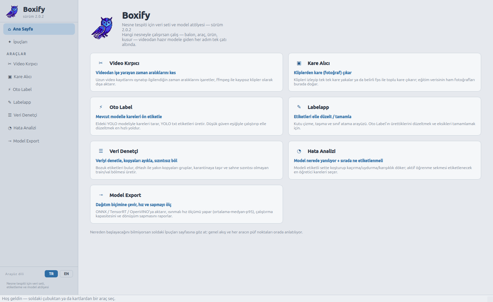

---

## Kurulum ve çalıştırma

Adımlar en güncel sürüm olan `Boxify-2.0.2/` için yazıldı; diğer sürüm klasörleri için de aynı
mantık geçerli, yalnızca klasör adını değiştirmen yeterli.

### 1) Bağımlılıkları kur

Conda gerekmez — sade bir Python sanal ortamı (`venv`) yeterli:

```bash
python3 -m venv .venv
source .venv/bin/activate
pip install -r Boxify-2.0.2/requirements.txt
```

Başlıca bağımlılıklar: `PyQt5`, `numpy`, `opencv-python`, `ultralytics>=8.4`, `PyYAML`.
TensorRT ve OpenVINO isteğe bağlıdır (yalnızca o export biçimleri için).

Ayrıca sistemde **ffmpeg** kurulu olmalı (video kırpma ve kare çıkarma için):

```bash
sudo apt install ffmpeg   # Debian/Ubuntu
```

#### (İsteğe bağlı) conda ile kurulum

Zaten conda kullanıyorsan aynı işi bir conda ortamıyla da yapabilirsin:

```bash
conda create -n boxify python=3.10
conda activate boxify
pip install -r Boxify-2.0.2/requirements.txt
```

PyQt5 + ultralytics içeren bir ortamın zaten varsa (ör. `a1b2`), doğrudan onu aktive edip
devam edebilirsin — `pip install` adımı gerekmez.

### 2) Uygulamayı çalıştır

```bash
cd Boxify-2.0.2
python boxify.py
```

### Windows'ta çalıştırma

Uygulamanın kendisi (`boxify.py` ve `boxify/` paketi) platform bağımsızdır ve Windows'ta da
çalışır — adımlar 1 ve 2 aynen geçerli, sadece komutları PowerShell/cmd'de çalıştır:

```powershell
python -m venv .venv
.venv\Scripts\activate
pip install -r Boxify-2.0.2\requirements.txt
cd Boxify-2.0.2
python boxify.py
```

Dikkat edilecekler:

- **ffmpeg** Windows'ta otomatik gelmez; [ffmpeg.org](https://ffmpeg.org/download.html)'dan indirip
  PATH'e eklemen gerekir (Video Kırpıcı ve Kare Alıcı bunu kullanır).
- **Masaüstü/Başlat Menüsü kısayolu:** `kur.sh` Linux'a özeldir; Windows'ta karşılığı `kur.bat`'tır
  — çalıştırınca `ikon.png`'yi otomatik `.ico`'ya çevirip masaüstüne ve Başlat Menüsü'ne ikonlu bir
  kısayol ekler (`kur.bat kaldir` ile kaldırılır). PyQt5 içeren bir `python`'un PATH'te olması
  yeterli.
- Araçlardaki "çıktı klasörünü aç" butonları `boxify/klasor_ac.py` üzerinden işletim sistemine göre
  doğru komutu seçer (Windows'ta `os.startfile`, macOS'ta `open`, Linux'ta `xdg-open`) — ek bir
  ayar gerekmez.

### 3) (İsteğe bağlı) Linux uygulama menüsüne ekle

Her seferinde terminalden `python boxify.py` yazmak yerine, uygulamayı sistemin uygulama
menüsüne kaydedebilirsin:

```bash
cd Boxify-2.0.2
./kur.sh          # menüye "Boxify" olarak ekler (ikonuyla birlikte)
```

`kur.sh` şunları otomatik yapar:

- PATH üzerinde PyQt5 içeren ilk python'u bulur ve kısayola onu yazar,
- `ikon.png`'yi 512×512 kareye getirip hicolor ikon temasına kurar,
- `~/.local/share/applications/boxify.desktop` dosyasını oluşturur.

Beklenen çıktı şuna benzer:

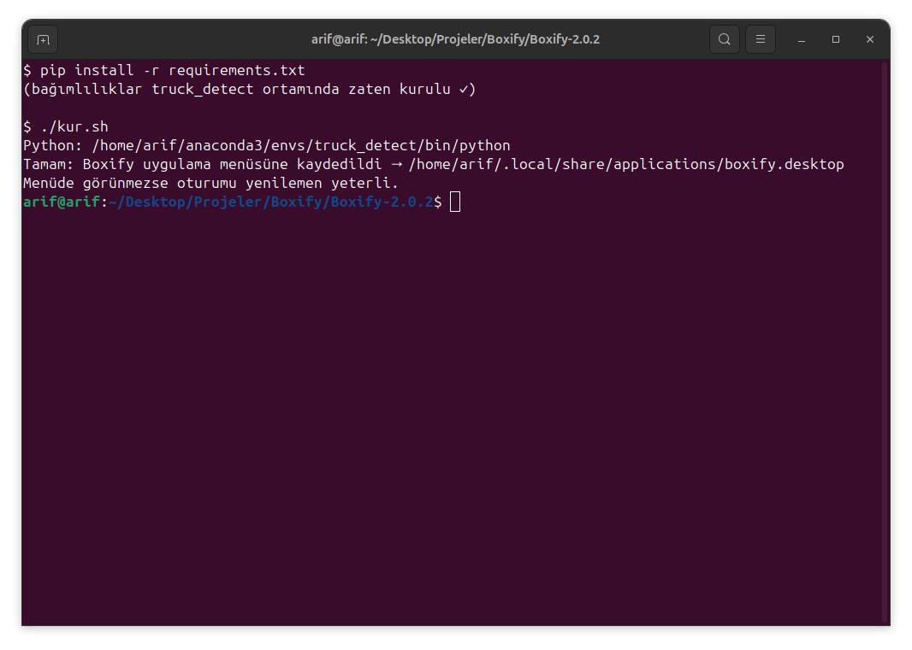

Menüde görünmezse oturumu (ya da sadece masaüstü ortamını) yeniden başlatmak genelde yeterlidir.
Klasörün adı ya da yeri değişirse `kur.sh`'ı bir kez daha çalıştırmak yeterlidir — kısayolu yeni
yola göre kendisi yeniden yazar. Kaldırmak için:

```bash
./kur.sh kaldir
```

### 3b) (İsteğe bağlı) Windows masaüstü + Başlat Menüsü kısayolu

Linux'taki `kur.sh`'ın karşılığı `kur.bat` — çift tıklayarak ya da PowerShell'den çalıştır:

```powershell
cd Boxify-2.0.2
.\kur.bat
```

`kur.bat` (arka planda `kur.ps1` çalıştırır) şunları otomatik yapar:

- PATH üzerinde PyQt5 içeren `pythonw`/`python`'u bulur,
- `ikon.png`'yi kareye tamamlayıp `ikon.ico`'ya çevirir,
- Masaüstüne ve Başlat Menüsü'ne `Boxify.lnk` kısayolunu ekler.

Kaldırmak için:

```powershell
.\kur.bat kaldir
```

---

## Sürüm geçmişi

Bu depo, projenin bütün evrimini sürüm klasörleri hâlinde içerir. Her klasörün kendi README'sinde
o sürümde nelerin değiştiği ekran görüntüleriyle anlatılıyor:

| Klasör | Sürüm | Ne oldu? |
|---|---|---|
| [`Boxify-1.0.0/`](Boxify-1.0.0/) | 1.0.0 | Başlangıç: **7 bağımsız araç**, her biri ayrı çalıştırılan ayrı program, koyu tema |
| [`Boxify-2.0.0/`](Boxify-2.0.0/) | 2.0.0 | 7 araç **tek uygulamada** birleşti: kenar çubuklu kabuk, tembel yükleme, "araç zinciri" anlatımı |
| [`Boxify-2.0.1/`](Boxify-2.0.1/) | 2.0.1 | Ürünleştirme: **açık beyaz-mavi tema**, İpuçları sayfası, zincir/adım numaraları kaldırıldı, metinler alan-bağımsız hâle getirildi |
| [`Boxify-2.0.2/`](Boxify-2.0.2/) | 2.0.2 | **TR/EN arayüz dili**: çeviri, araç kodlarına dokunmayan bir dil eklentisiyle (`dil.py`) yapıldı — **güncel sürüm** |

Sürümler birbirinin üzerine yazılmadı; her biri kendi klasöründe bağımsız olarak çalışır durumda
duruyor. Böylece projenin gelişimi adım adım izlenebiliyor.

---

## Genel akış

Ham videodan dağıtıma hazır modele giden yol:

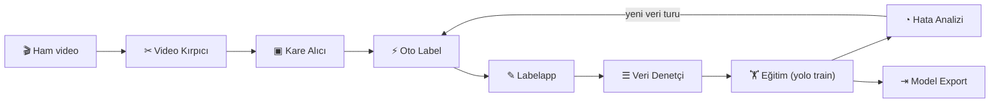

Eğitim adımı uygulama dışıdır (`yolo train data=.../data.yaml`); Boxify eğitimin **öncesini**
(veri hazırlığı) ve **sonrasını** (analiz + export) üstlenir. Hata Analizi'nin çıktısı yeni bir
etiketleme turunu besler — döngü, model hedef başarıya ulaşana kadar döner.

---

## Araçlar

Yedi araç, sol kenar çubuğundan ya da ana sayfadaki kartlardan açılır. Her araç ilk tıklamada
yüklenir (tembel yükleme) ve sekme değişse bile arka plandaki işleri — çıkarım, export,
kopyalama — çalışmaya devam eder.

### ✂ Video Kırpıcı — videodan işe yarayan zaman aralıklarını kes

Uzun video kayıtlarını oynatıp ilgilendiğin zaman aralıklarını işaretler, **ffmpeg ile kayıpsız**
(yeniden kodlamasız) klipler olarak dışa aktarır. Kesim saniyeler sürer; farklı ışık, açı ve arka
plan içeren bölümleri bol bol almak modelin genellemesini doğrudan iyileştirir.

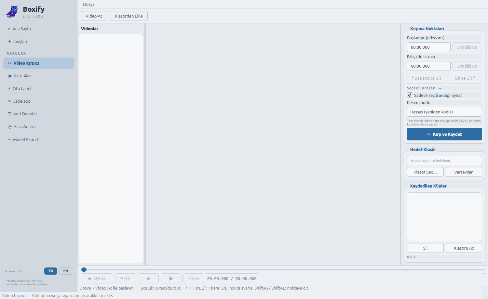

### ▣ Kare Alıcı — kliplerden kare (fotoğraf) çıkar

Klipleri izleyip tek tek kare yakalar ya da belirli fps ile toplu kare çıkarır; eğitim verisinin
ham fotoğrafları burada doğar. Toplu çıkarımda düşük fps (1–2) önerilir — ardışık kareler
birbirinin kopyasıdır ve veri setini şişirir.


### ⚡ Oto Label — mevcut modelle kareleri ön etiketle

Eldeki YOLO modeliyle kareleri tarar, YOLO txt etiketleri üretir. Düşük güven eşiğiyle (örn. 0.25)
çalıştırıp elle düzeltmek, sıfırdan etiketlemekten çok daha hızlıdır: fazladan kutuyu silmek,
kaçırılmış nesneyi çizmekten kolaydır. İlk turda hazır bir COCO modeli bile işe yarar.

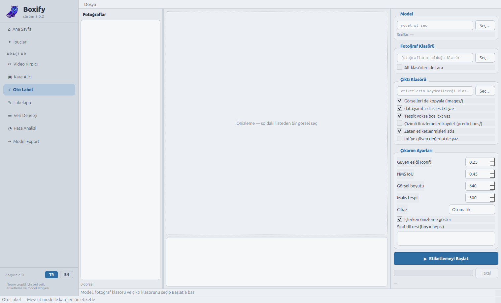

### ✎ Labelapp — etiketleri elle düzelt / tamamla

Kutu çizme, taşıma ve sınıf atama arayüzü. Oto Label'ın ürettiklerini gözden geçirmek ve eksikleri
tamamlamak için. Klavye kısayollarıyla hızlı gezinme (A/D ile önceki/sonraki kare), sınıf yönetimi
ve uygulama içinden eğitim başlatma da burada.

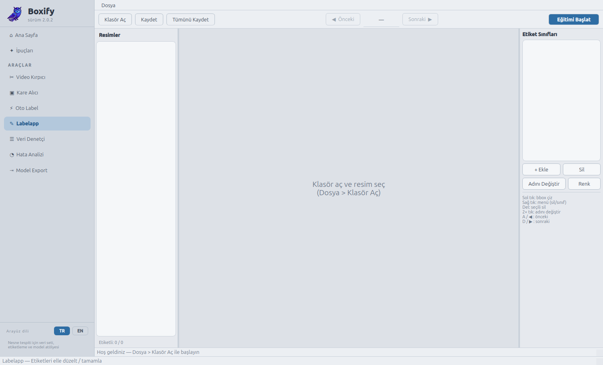

### ☰ Veri Denetçi — denetle, kopyaları ayıkla, sızıntısız böl

Eğitimden önceki kalite kapısı: bozuk/eksik etiketleri bulur, **dHash** ile yakın kopyaları
gruplar, sorunluları karantinaya taşır ve **sahne sızıntısı olmayan** train/val bölmesi üretir
(yakın kopyaların aynı anda train ve val'e düşmesi başarıyı yapay şişirir — bölme bunu engeller).
Hiçbir dosya silinmez; her şey karantina klasörüne taşınır, geri alınabilir.

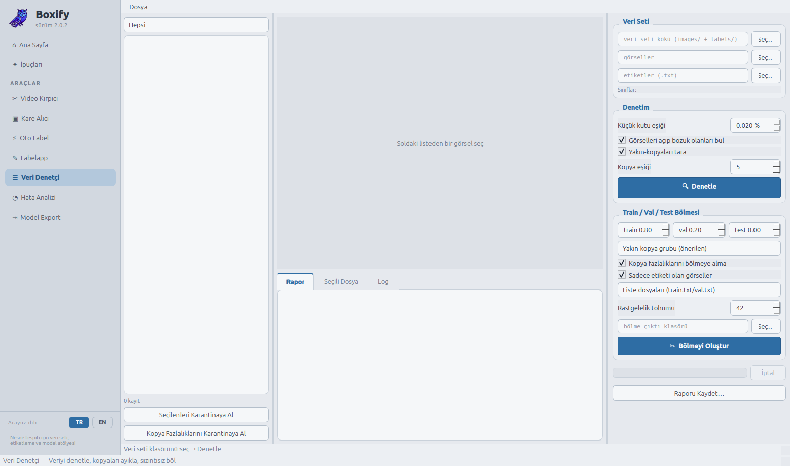

### ◔ Hata Analizi — model nerede yanılıyor + sırada ne etiketlenmeli

Modeli etiketli sette koşturup kaçırma / uydurma / sınıf karışıklığı dökümü çıkarır. **Aktif
öğrenme** sekmesi, modelin en kararsız kaldığı kareleri öne çıkarır — bir sonraki etiketleme
turunda rastgele kare seçmekten çok daha verimlidir.

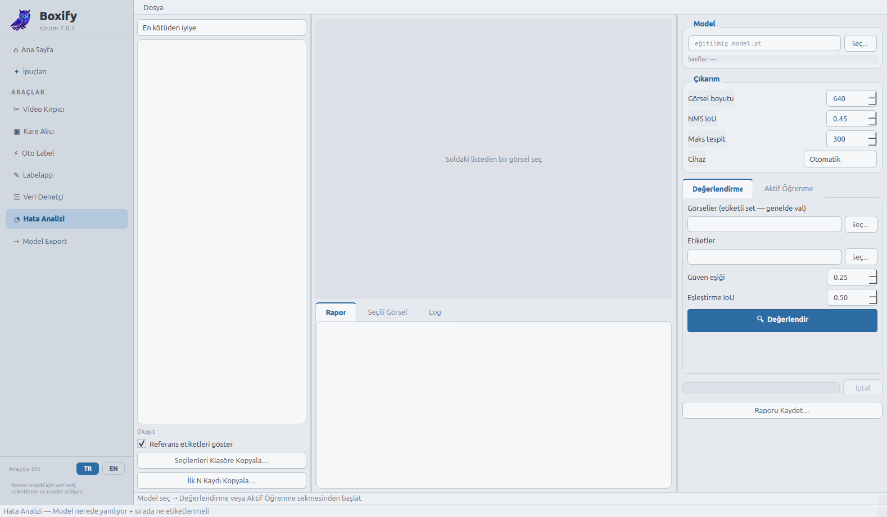

### ⇥ Model Export — dağıtım biçimine çevir, hız ve sapmayı ölç

Eğitilen modeli **ONNX / TensorRT / OpenVINO**'ya aktarır; ısınmalı hız ölçümü yapar
(ortalama – medyan – p95), çalıştırma kapasitesini ve **dönüşüm sapmasını** (dönüştürülen modelin
orijinalden ne kadar saptığını) raporlar. Ölçümü hedef donanımda yapmak esastır.

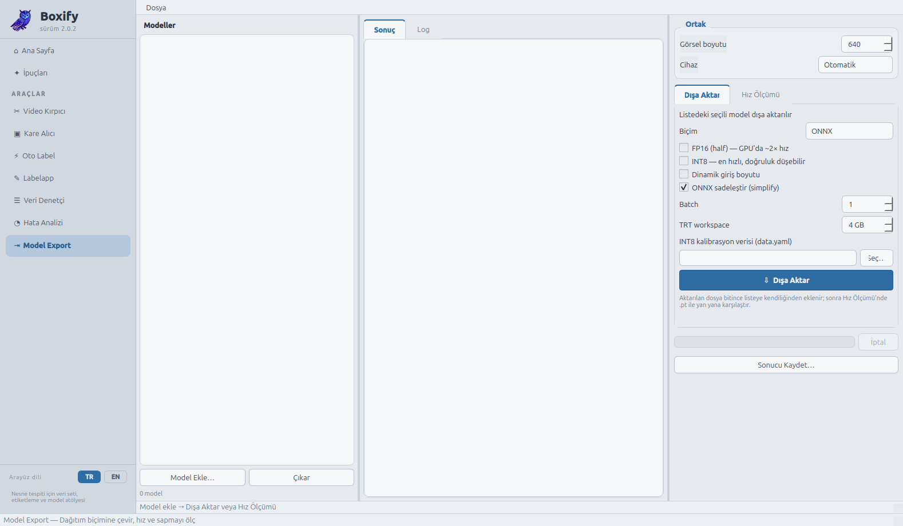

### ✦ İpuçları sayfası

Genel akışın nasıl işlediği ve her aracın püf noktaları uygulamanın içinde de anlatılır
(2.0.1 ile eklendi):

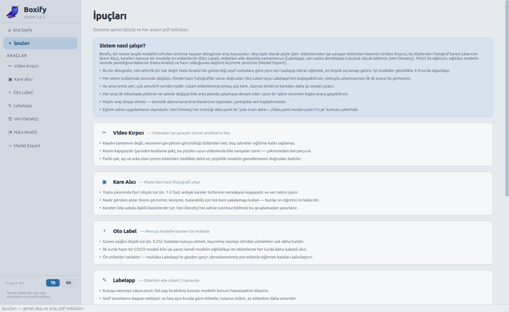

### 🌐 TR / EN arayüz dili

2.0.2 ile kenar çubuğunun dibindeki düğmelerden arayüz dili değiştirilebilir; uygulama yeniden
başlatılarak seçim her yere işlenir:

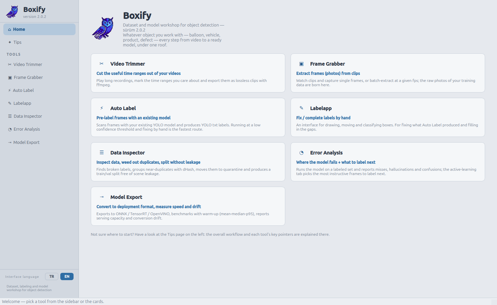

---

## Depo yapısı

```
Boxify/
├── README.md                 # bu dosya
├── Boxify-1.0.0/             # 7 bağımsız araç (her biri ayrı program)
│   ├── videokırpıcı/  KareAlici/  oto-label/  Labelapp/
│   ├── veri-denetci/  hata-analizi/  model-export/
│   └── gorseller/            # ekran görüntüleri
├── Boxify-2.0.0/             # birleşik uygulama, koyu tema, araç zinciri
├── Boxify-2.0.1/             # açık tema + İpuçları sayfası
└── Boxify-2.0.2/             # TR/EN dil desteği (güncel)
    ├── boxify.py             # başlatıcı (glib düzeltmesi + QApplication)
    ├── ikon.png              # uygulama ikonu
    ├── kur.sh                # Linux menü kaydı / kaldırma
    ├── kur.bat / kur.ps1     # Windows masaüstü + Başlat Menüsü kısayolu
    ├── requirements.txt
    ├── gorseller/            # ekran görüntüleri
    └── boxify/
        ├── __init__.py       # sürüm bilgisi
        ├── dil.py            # TR/EN dil eklentisi
        ├── tema.py           # açık tema (beyaz + mavi)
        ├── ana_pencere.py    # kabuk: kenar çubuğu + sayfa yığını
        ├── sayfalar/         # anasayfa + ipuçları
        └── araclar/          # 7 aracın modülleri
```

---

## Teknik notlar

- **Tembel yükleme:** `ultralytics`/`cv2` gibi ağır bağımlılıklar açılışı yavaşlatmasın diye her
  aracın modülü ancak araç ilk kez açıldığında import edilir.
- **Arka plan işleri:** Araçların QThread işçileri sekme değişince durmaz; uzun süren çıkarım ve
  export işleri arka planda sürer.
- **Tek başına çalıştırma:** Her araç modülü bağımsız da açılabilir:
  `python -m boxify.araclar.veri_denetci` (sürüm klasörünün içinde).
- **Veri güvenliği:** Hiçbir araç dosya silmez; temizlik daima karantina klasörüne taşımadır.
- **Renk körlüğü dostu tema:** Arayüz kırmızı-yeşil ayrımına dayanmaz; vurgular mavi (ikincil
  olarak koyu metinli kehribar), durumlar ayrıca metin ve çizgi deseniyle verilir. Görüntü/video
  tuvalleri kasıtlı olarak koyu kalır — kutu renkleri üzerinde daha iyi seçilir.
- **GStreamer düzeltmesi:** Conda glib'i ile sistem gstreamer eklentileri çakıştığında çıkan
  "missing a plug-in" hatası başlatıcıda `LD_PRELOAD` ile otomatik düzeltilir
  (kapatmak için `VK_NO_GLIB_FIX=1`).
- **Dil mimarisi (2.0.2):** İngilizce, araç kodlarına dokunmadan eklendi — PyQt metin API'leri
  (setText, setToolTip, QMessageBox…) monkey-patch ile bir çeviri sözlüğünden geçirilir.
  Ayrıntı: [`Boxify-2.0.2/README.md`](Boxify-2.0.2/README.md).
