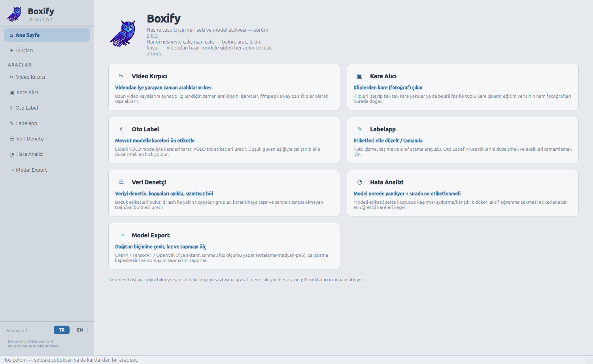
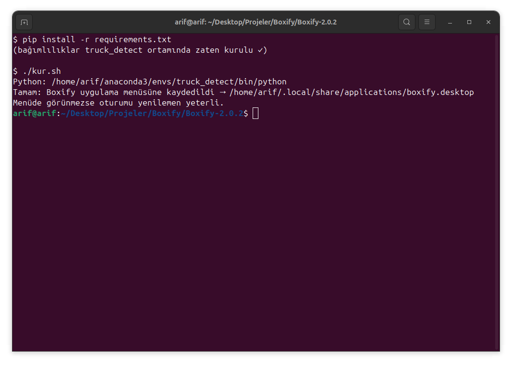
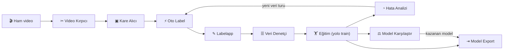
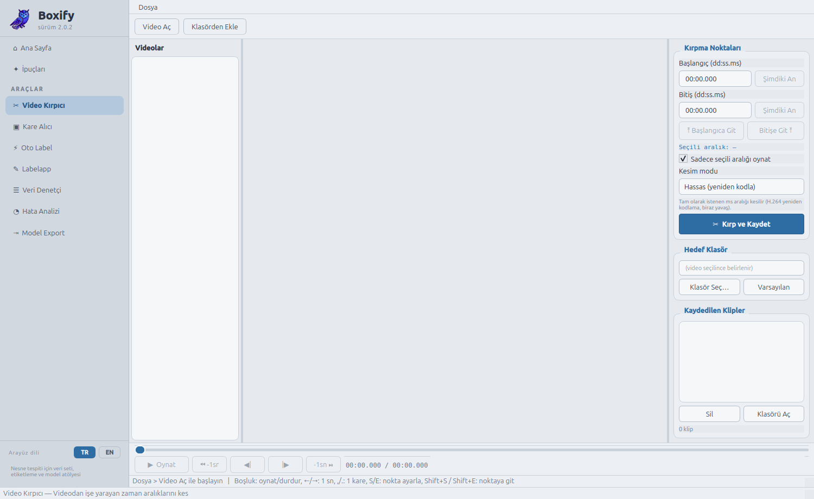
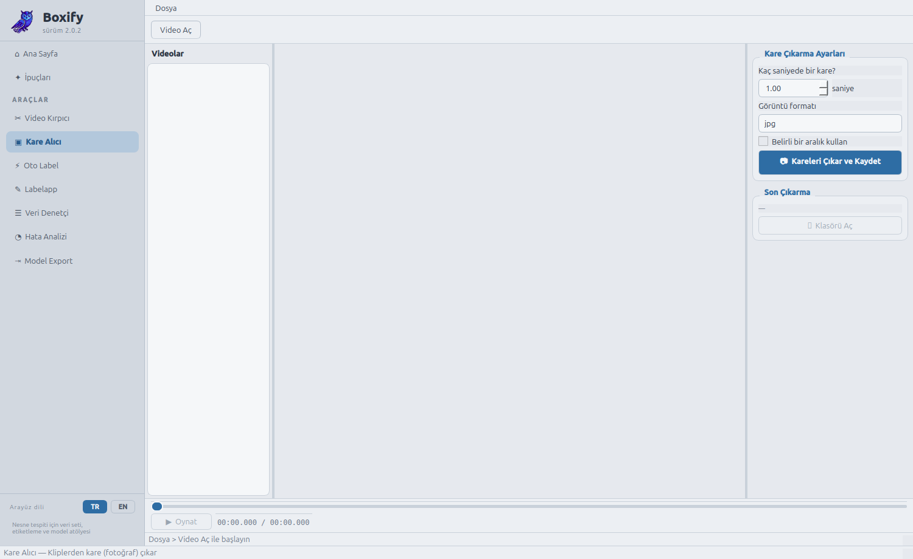
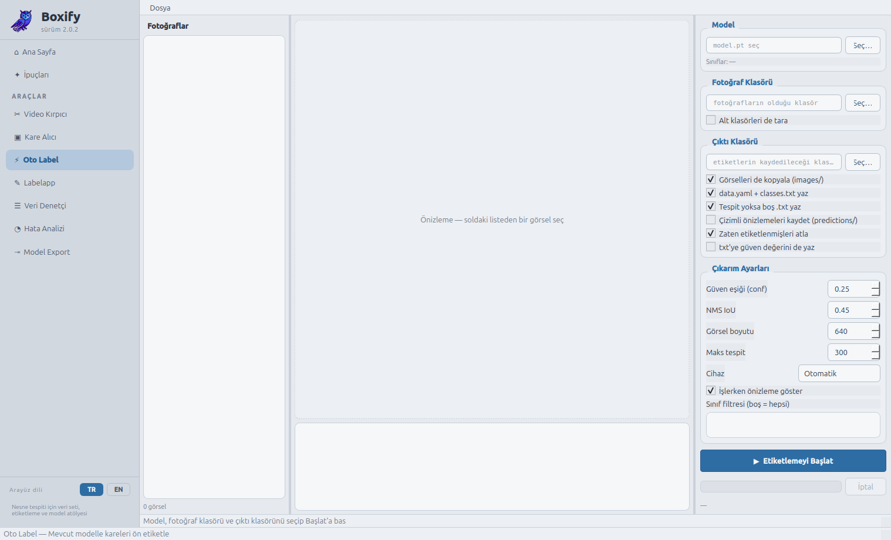
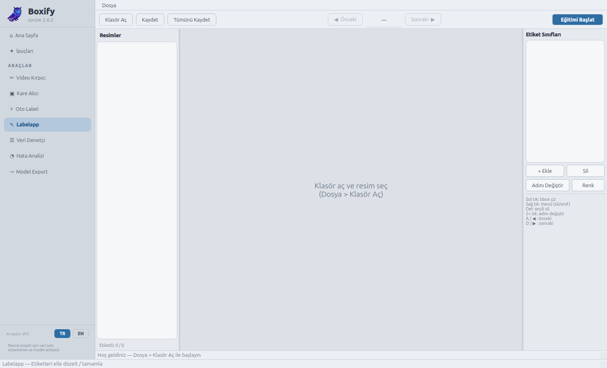
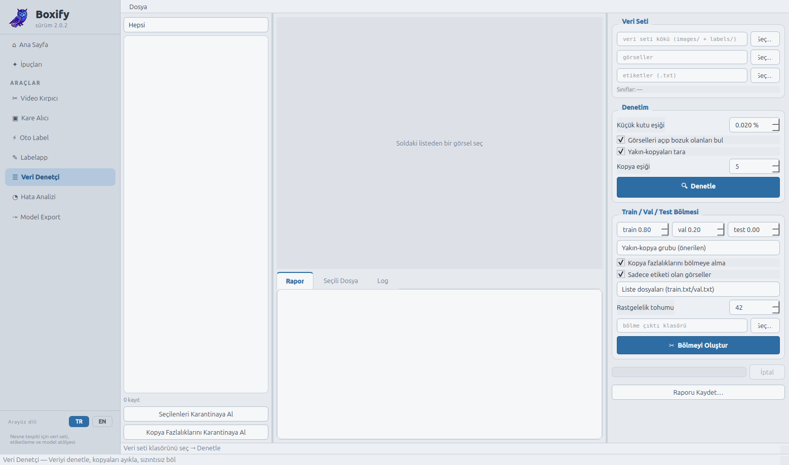
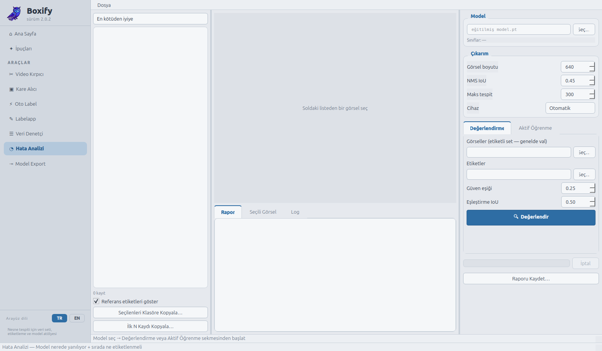
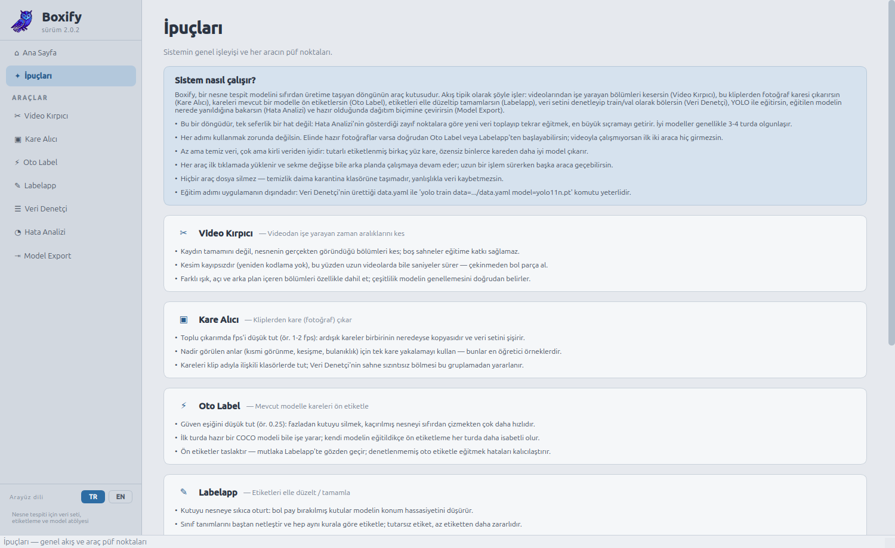

# 🦉 Boxify — Nesne Tespiti Veri ve Model Atölyesi

Boxify, bir **nesne tespit (object detection) modeli** üretmenin bütün adımlarını tek çatı altında
toplayan, PyQt5 ile yazılmış bir masaüstü uygulamasıdır: videodan kare çıkarma, otomatik ve elle
etiketleme, veri seti denetimi, hata analizi, model karşılaştırma ve model export.

Belirli bir alana bağlı değildir — balon, araç, ürün, kusur… hangi nesneyi tanımak istersen aynı
akış geçerlidir. Etiket biçimi YOLO txt'dir ve araçlar Ultralytics YOLO modelleriyle çalışır.



---

## Kurulum ve çalıştırma

### 1) Bağımlılıkları kur

Conda gerekmez — sade bir Python sanal ortamı (`venv`) yeterli:

```bash
python3 -m venv .venv
source .venv/bin/activate
pip install -r requirements.txt
```

Başlıca bağımlılıklar: `PyQt5`, `numpy`, `opencv-python`, `ultralytics>=8.4`, `PyYAML`.
TensorRT ve OpenVINO isteğe bağlıdır (yalnızca o export biçimleri için).

Ayrıca sistemde **ffmpeg** kurulu olmalı (video kırpma ve kare çıkarma için):

```bash
sudo apt install ffmpeg   # Debian/Ubuntu
```

#### (İsteğe bağlı) conda ile kurulum

Zaten conda kullanıyorsan aynı işi bir conda ortamıyla da yapabilirsin:

```bash
conda create -n boxify python=3.10
conda activate boxify
pip install -r requirements.txt
```

PyQt5 + ultralytics içeren bir ortamın zaten varsa (ör. `a1b2`), doğrudan onu aktive edip
devam edebilirsin — `pip install` adımı gerekmez.

### 2) Uygulamayı çalıştır

```bash
python boxify.py
```

### Windows'ta çalıştırma

Uygulamanın kendisi (`boxify.py` ve `boxify/` paketi) platform bağımsızdır ve Windows'ta da
çalışır — adımlar 1 ve 2 aynen geçerli, sadece komutları PowerShell/cmd'de çalıştır:

```powershell
python -m venv .venv
.venv\Scripts\activate
pip install -r requirements.txt
python boxify.py
```

Dikkat edilecekler:

- **ffmpeg** Windows'ta otomatik gelmez; [ffmpeg.org](https://ffmpeg.org/download.html)'dan indirip
  PATH'e eklemen gerekir (Video Kırpıcı ve Kare Alıcı bunu kullanır).
- **Masaüstü/Başlat Menüsü kısayolu:** `kur.sh` Linux'a özeldir; Windows'ta karşılığı `kur.bat`'tır
  — çalıştırınca `ikon.png`'yi otomatik `.ico`'ya çevirip masaüstüne ve Başlat Menüsü'ne ikonlu bir
  kısayol ekler (`kur.bat kaldir` ile kaldırılır). PyQt5 içeren bir `python`'un PATH'te olması
  yeterli.
- Araçlardaki "çıktı klasörünü aç" butonları `boxify/klasor_ac.py` üzerinden işletim sistemine göre
  doğru komutu seçer (Windows'ta `os.startfile`, macOS'ta `open`, Linux'ta `xdg-open`) — ek bir
  ayar gerekmez.

### 3) (İsteğe bağlı) Linux uygulama menüsüne ekle

Her seferinde terminalden `python boxify.py` yazmak yerine, uygulamayı sistemin uygulama
menüsüne kaydedebilirsin:

```bash
./kur.sh          # menüye "Boxify" olarak ekler (ikonuyla birlikte)
```

`kur.sh` şunları otomatik yapar:

- PATH üzerinde PyQt5 içeren ilk python'u bulur ve kısayola onu yazar,
- `ikon.png`'yi 512×512 kareye getirip hicolor ikon temasına kurar,
- `~/.local/share/applications/boxify.desktop` dosyasını oluşturur.

Beklenen çıktı şuna benzer:



Menüde görünmezse oturumu (ya da sadece masaüstü ortamını) yeniden başlatmak genelde yeterlidir.
Klasörün adı ya da yeri değişirse `kur.sh`'ı bir kez daha çalıştırmak yeterlidir — kısayolu yeni
yola göre kendisi yeniden yazar. Kaldırmak için:

```bash
./kur.sh kaldir
```

### 3b) (İsteğe bağlı) Windows masaüstü + Başlat Menüsü kısayolu

Linux'taki `kur.sh`'ın karşılığı `kur.bat` — çift tıklayarak ya da PowerShell'den çalıştır:

```powershell
.\kur.bat
```

`kur.bat` (arka planda `kur.ps1` çalıştırır) şunları otomatik yapar:

- PATH üzerinde PyQt5 içeren `pythonw`/`python`'u bulur,
- `ikon.png`'yi kareye tamamlayıp `ikon.ico`'ya çevirir,
- Masaüstüne ve Başlat Menüsü'ne `Boxify.lnk` kısayolunu ekler.

Kaldırmak için:

```powershell
.\kur.bat kaldir
```

---

## Sürüm geçmişi

Her sürüm bir **git tag'i** olarak işaretlidir; eski bir sürümü çalışır hâlde görmek için o tag'e
geçmen yeterli:

```bash
git checkout v2.0.2      # o sürümün tam ağacı
git checkout main        # güncele dön
```

| Sürüm | Ne oldu? |
|---|---|
| [`v1.0.0`](../../releases/tag/v1.0.0) | Başlangıç: **7 bağımsız araç**, her biri ayrı çalıştırılan ayrı program, koyu tema |
| [`v2.0.0`](../../releases/tag/v2.0.0) | 7 araç **tek uygulamada** birleşti: kenar çubuklu kabuk, tembel yükleme, "araç zinciri" anlatımı |
| [`v2.0.1`](../../releases/tag/v2.0.1) | Ürünleştirme: **açık beyaz-mavi tema**, İpuçları sayfası, zincir/adım numaraları kaldırıldı, metinler alan-bağımsız hâle getirildi |
| [`v2.0.2`](../../releases/tag/v2.0.2) | **TR/EN arayüz dili**: çeviri, araç kodlarına dokunmayan bir dil eklentisiyle (`dil.py`) yapıldı |
| [`v3.0.0`](../../releases/tag/v3.0.0) | **⚖ Model Karşılaştır** (sekizinci araç) + arayüz akıcılığı düzeltmeleri; depo tek kod tabanına düzleştirildi — **güncel sürüm** |

### 3.0.0'da neler değişti

- **⚖ Model Karşılaştır** — aynı video üzerinde 1–3 YOLO modelini kıyaslayan yeni araç.
  Her modelin **sınıfları tek tek açılıp kapatılabilir** ve istenirse her model **kendi conf /
  IoU / imgsz / maks-tespit ayarıyla** koşturulabilir. Tek modelle de çalışır.
- **Araç geçişlerindeki donmalar giderildi** — üç ayrı kaynak vardı: ana iş parçacığında yapılan
  `YOLO()` çağrısı, gömülü sayfaların ana pencereye taşan alt boyut sınırı ve kurucu içinde
  açılan modal diyalog. Ayrıntı: [Teknik notlar](#teknik-notlar).
- **Sol panel erişilebilirliği** — Model Karşılaştır'da ayarlar görünür alanı aşıp en çok
  kullanılan düğmeleri kıvrımın altında bırakıyordu. Zorunlu denetimler (çıktı klasörü, Başlat,
  İptal) artık kaydırmayan bir şeritte sabit duruyor; nadir kullanılan ayar grupları katlanabilir.
- **Depo düzleştirildi** — kod artık kökte tek bir ağaçta (`boxify.py` + `boxify/`); eski sürüm
  klasörleri kaldırıldı, geçmiş yukarıdaki tag'lerde duruyor.
- **Çeviri boşlukları kapatıldı** — Hata Analizi, Model Export, Veri Denetçi ve Video Kırpıcı'da
  İngilizce moda düşmeyen 26 etiket tamamlandı.

---

## Genel akış

Ham videodan dağıtıma hazır modele giden yol:



Eğitim adımı uygulama dışıdır (`yolo train data=.../data.yaml`); Boxify eğitimin **öncesini**
(veri hazırlığı) ve **sonrasını** (analiz + export) üstlenir. Hata Analizi'nin çıktısı yeni bir
etiketleme turunu besler — döngü, model hedef başarıya ulaşana kadar döner.

---

## Araçlar

Sekiz araç, sol kenar çubuğundan ya da ana sayfadaki kartlardan açılır. Her araç ilk tıklamada
yüklenir (tembel yükleme) ve sekme değişse bile arka plandaki işleri — çıkarım, export,
kopyalama — çalışmaya devam eder.

### ✂ Video Kırpıcı — videodan işe yarayan zaman aralıklarını kes

Uzun video kayıtlarını oynatıp ilgilendiğin zaman aralıklarını işaretler, **ffmpeg ile kayıpsız**
(yeniden kodlamasız) klipler olarak dışa aktarır. Kesim saniyeler sürer; farklı ışık, açı ve arka
plan içeren bölümleri bol bol almak modelin genellemesini doğrudan iyileştirir.



### ▣ Kare Alıcı — kliplerden kare (fotoğraf) çıkar

Klipleri izleyip tek tek kare yakalar ya da belirli fps ile toplu kare çıkarır; eğitim verisinin
ham fotoğrafları burada doğar. Toplu çıkarımda düşük fps (1–2) önerilir — ardışık kareler
birbirinin kopyasıdır ve veri setini şişirir.



### ⚡ Oto Label — mevcut modelle kareleri ön etiketle

Eldeki YOLO modeliyle kareleri tarar, YOLO txt etiketleri üretir. Düşük güven eşiğiyle (örn. 0.25)
çalıştırıp elle düzeltmek, sıfırdan etiketlemekten çok daha hızlıdır: fazladan kutuyu silmek,
kaçırılmış nesneyi çizmekten kolaydır. İlk turda hazır bir COCO modeli bile işe yarar.



### ✎ Labelapp — etiketleri elle düzelt / tamamla

Kutu çizme, taşıma ve sınıf atama arayüzü. Oto Label'ın ürettiklerini gözden geçirmek ve eksikleri
tamamlamak için. Klavye kısayollarıyla hızlı gezinme (A/D ile önceki/sonraki kare), sınıf yönetimi
ve uygulama içinden eğitim başlatma da burada.



### ☰ Veri Denetçi — denetle, kopyaları ayıkla, sızıntısız böl

Eğitimden önceki kalite kapısı: bozuk/eksik etiketleri bulur, **dHash** ile yakın kopyaları
gruplar, sorunluları karantinaya taşır ve **sahne sızıntısı olmayan** train/val bölmesi üretir
(yakın kopyaların aynı anda train ve val'e düşmesi başarıyı yapay şişirir — bölme bunu engeller).
Hiçbir dosya silinmez; her şey karantina klasörüne taşınır, geri alınabilir.



### ◔ Hata Analizi — model nerede yanılıyor + sırada ne etiketlenmeli

Modeli etiketli sette koşturup kaçırma / uydurma / sınıf karışıklığı dökümü çıkarır. **Aktif
öğrenme** sekmesi, modelin en kararsız kaldığı kareleri öne çıkarır — bir sonraki etiketleme
turunda rastgele kare seçmekten çok daha verimlidir.



### ⚖ Model Karşılaştır — aynı videoda 1–3 modeli ve seçilen sınıfları kıyasla

Aynı video üzerinde **1–3 YOLO modelini** aynı anda koşturur; her kare önce ortak bir panel
yüksekliğine ölçeklenir (tüm modeller **birebir aynı pikselleri** görsün diye), sonra sırayla her
modelden geçirilir. Tespitler model adı/renk etiketiyle yan yana — dikey videoda alt alta —
bindirilip tek bir karşılaştırma videosuna yazılır; istersen model başına ayrı video da çıkar.

Her modelin **sınıfları tek tek açılıp kapatılabilir** (ör. A'da yalnızca `tir`, B'de hepsi) ve
istenirse her model **kendi conf / IoU / imgsz / maks-tespit ayarıyla** koşturulabilir. Varsayılan
ortak ayardır — kıyası adil tutan budur; özel ayar açıldığında rapor bunu ayrıca not eder.

Rapor; model başına tespit sayısı, kare başına tespit, ortalama güven, boş kare oranı ve hız
(ort. ms / fps) verir. Modellerin sınıf kümeleri farklıysa "toplam tespit sayılarını doğrudan
kıyaslamak yanıltıcı olabilir" uyarısını da basar. Tek model seçilirse çıktı bir kıyas değil,
o modelin video üzerindeki davranış dökümüdür.

> Hız rakamları kabaca fikir verir; kesin ölçüm için Model Export'taki Hız Ölçümü'nü kullan.

### ⇥ Model Export — dağıtım biçimine çevir, hız ve sapmayı ölç

Eğitilen modeli **ONNX / TensorRT / OpenVINO**'ya aktarır; ısınmalı hız ölçümü yapar
(ortalama – medyan – p95), çalıştırma kapasitesini ve **dönüşüm sapmasını** (dönüştürülen modelin
orijinalden ne kadar saptığını) raporlar. Ölçümü hedef donanımda yapmak esastır.


### ✦ İpuçları sayfası

Genel akışın nasıl işlediği ve her aracın püf noktaları uygulamanın içinde de anlatılır
(2.0.1 ile eklendi):



### 🌐 TR / EN arayüz dili

2.0.2 ile kenar çubuğunun dibindeki düğmelerden arayüz dili değiştirilebilir; uygulama yeniden
başlatılarak seçim her yere işlenir:


---

## Depo yapısı

```
Boxify/
├── README.md                 # bu dosya
├── LICENSE
├── boxify.py                 # başlatıcı (glib düzeltmesi + dil yamaları + QApplication)
├── requirements.txt
├── ikon.png                  # uygulama ikonu
├── kur.sh                    # Linux menü kaydı / kaldırma (boxify.desktop)
├── kur.bat / kur.ps1         # Windows masaüstü + Başlat Menüsü kısayolu
├── gorseller/                # ekran görüntüleri
└── boxify/
    ├── __init__.py           # sürüm bilgisi (3.0.0)
    ├── dil.py                # TR/EN dil eklentisi: sözlük + PyQt çeviri yamaları
    ├── tema.py               # ortak açık tema (beyaz + mavi, renk körlüğü dostu)
    ├── klasor_ac.py          # işletim sistemine göre "klasörü aç"
    ├── ana_pencere.py        # kabuk: kenar çubuğu + sayfa yığını + dil değiştirici
    ├── sayfalar/
    │   ├── anasayfa.py       # kartlı karşılama panosu
    │   └── ipuclari.py       # genel akış + araç bazlı ipuçları
    └── araclar/
        ├── __init__.py       # araç kaydı (ad, açıklama, ipuçları, modül)
        ├── model_bilgi.py    # model sınıf adlarını arka planda okuyan ortak yardımcı
        ├── video_kirpici.py
        ├── kare_alici.py
        ├── oto_label.py
        ├── labelapp/         # core/ (veri) + ui/ (arayüz) paketi
        ├── veri_denetci.py
        ├── hata_analizi.py
        ├── model_karsilastir.py
        └── model_export.py
```

Eski sürümlerin dosya düzeni farklıydı (her sürüm ayrı bir klasördü); onları görmek için ilgili
tag'e geçebilirsin — bkz. [Sürüm geçmişi](#sürüm-geçmişi).

---

## Teknik notlar

- **Tembel yükleme:** `ultralytics`/`cv2` gibi ağır bağımlılıklar açılışı yavaşlatmasın diye her
  aracın modülü ancak araç ilk kez açıldığında import edilir. Import'un kendisi de arayüz
  iş parçacığında değil, ayrı bir QThread'de yapılır — pencere yükleme boyunca yanıt verir.
- **Arka plan işleri:** Araçların QThread işçileri sekme değişince durmaz; uzun süren çıkarım ve
  export işleri arka planda sürer.
- **Model üstverisi arka planda okunur:** Model seçildiğinde sınıf adları için gereken
  `from ultralytics import YOLO` ilk çağrıda torch'u da yükler (saniyeler sürer). Bu okuma ortak
  bir yardımcıya (`araclar/model_bilgi.py`) alındı; Model Karşılaştır, Oto Label ve Hata Analizi
  bunu kullanır, dolayısıyla model seçmek arayüzü kilitlemez.
- **Sayfa geçişleri:** Araçlar tek başına çalışmak için kendilerine geniş bir alt boyut sınırı
  koyar (ör. 1360×840). Yığına doğrudan gömülseler bu sınır ana pencereye taşınır ve her yeni
  araçta pencere zorla büyür. Bu yüzden her araç sayfası bir kaydırma alanına sarılır: pencere
  küçük kalabilir, sığmayan araç kendi içinde kaydırılır.
- **Arka planda medya:** Video Kırpıcı ve Kare Alıcı, sayfaları gizlendiğinde oynatmayı
  duraklatır — yoksa QMediaPlayer görünmeyen bir videoyu çözmeye devam eder ve öndeki aracı
  yavaşlatır.
- **Kurucuda modal diyalog yok:** Henüz gösterilmemiş bir pencereye bağlanan modal uyarı bazı
  masaüstlerinde diğer pencerelerin arkasında kalıp uygulamayı kilitlenmiş gösterir. Eksik ffmpeg
  gibi uyarılar bu yüzden durum çubuğunda verilir, modal kutu yalnızca ilgili işleme basılınca
  çıkar.
- **Tek başına çalıştırma:** Her araç modülü bağımsız da açılabilir:
  `python -m boxify.araclar.veri_denetci` (sürüm klasörünün içinde).
- **Veri güvenliği:** Hiçbir araç dosya silmez; temizlik daima karantina klasörüne taşımadır.
- **Renk körlüğü dostu tema:** Arayüz kırmızı-yeşil ayrımına dayanmaz; vurgular mavi (ikincil
  olarak koyu metinli kehribar), durumlar ayrıca metin ve çizgi deseniyle verilir. Görüntü/video
  tuvalleri kasıtlı olarak koyu kalır — kutu renkleri üzerinde daha iyi seçilir.
- **GStreamer düzeltmesi:** Conda glib'i ile sistem gstreamer eklentileri çakıştığında çıkan
  "missing a plug-in" hatası başlatıcıda `LD_PRELOAD` ile otomatik düzeltilir
  (kapatmak için `VK_NO_GLIB_FIX=1`).
- **Dil mimarisi (2.0.2):** İngilizce, araç kodlarına dokunmadan eklendi — PyQt metin API'leri
  (setText, setToolTip, QMessageBox…) monkey-patch ile bir çeviri sözlüğünden geçirilir; sözlükte
  karşılığı olmayan metin (dosya yolu, sınıf adı…) olduğu gibi kalır. Türkçe moddayken hiçbir yama
  kurulmaz. Yeni dil eklemek için `boxify/dil.py` içindeki `SOZLUK`/`KALIPLAR` yapısına bir sözlük
  eklemek ve `DILLER`'i genişletmek yeterlidir.
